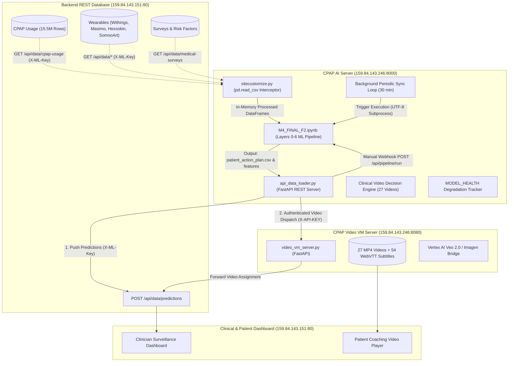
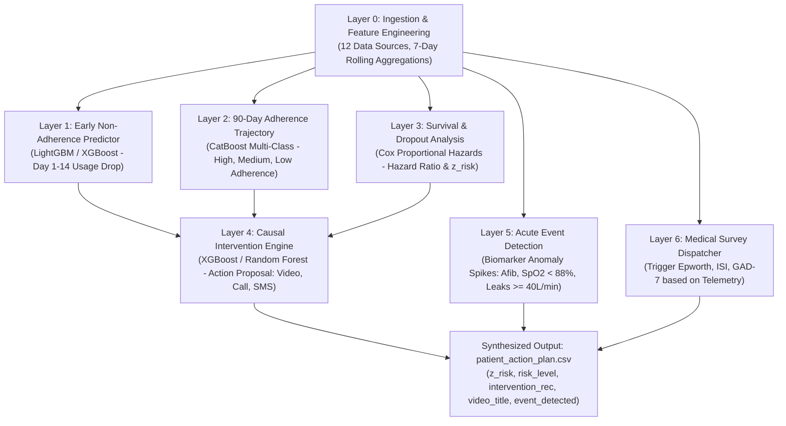
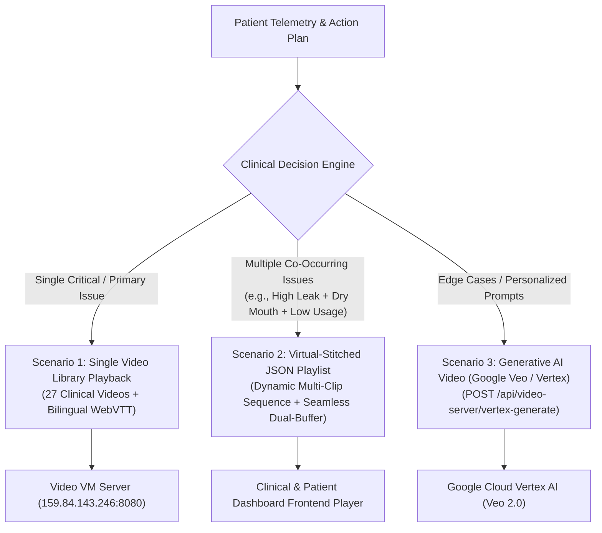

# SleepCare CPAP AI Supervisor Server & Biomarker Intelligence Engine

A continuous 24/7 AI scoring, multimodal biomarker fusion, survival analysis, and automated clinical coaching intervention engine for CPAP therapy compliance, adherence prediction, cardiovascular risk surveillance, and multi-node video orchestration.

---

## 📑 Table of Contents

1. [System Overview & Architecture](#-system-overview--architecture)
2. [Folder & File Structure](#-folder--file-structure)
3. [Multi-Layer AI Architecture (Layers 0–6)](#-multi-layer-ai-architecture-layers-06)
4. [Clinical Video Orchestration & 3 Scenarios Architecture](#-clinical-video-orchestration--3-scenarios-architecture)
5. [Core Engine Components](#-core-engine-components)
   - [API Data Loader & REST Server (`api_data_loader.py`)](#1-api-data-loader--rest-server-api_data_loaderpy)
   - [Model Pipeline Notebook (`M4_FINAL_F2.ipynb`)](#2-model-pipeline-notebook-m4_final_f2ipynb)
   - [Runtime Interceptor & Virtualization (`sitecustomize.py`)](#3-runtime-interceptor--virtualization-sitecustomizepy)
   - [Universal Server Launcher (`run_ai_server.bat`)](#4-universal-server-launcher-run_ai_serverbat)
6. [Live Console & Structured Logging](#-live-console--structured-logging)
7. [Complete REST API Reference](#-complete-rest-api-reference)
   - [Discovery & Health Monitoring](#1-discovery--health-monitoring)
   - [Cohort & Patient Risk Intelligence](#2-cohort--patient-risk-intelligence)
   - [AI Pipeline Trigger & Synchronization](#3-ai-pipeline-trigger--synchronization)
   - [Video VM Server Microservice Dispatch](#4-video-vm-server-microservice-dispatch)
8. [Security, Encryption & Defense-in-Depth](#-security-encryption--defense-in-depth)
   - [In-Transit Encryption (Network / Wire)](#1-in-transit-encryption-network--wire)
   - [At-Rest Encryption (Disk & Artifacts)](#2-at-rest-encryption-disk--artifacts)
   - [API Token Authentication & Access Control](#3-api-token-authentication--access-control)
   - [Malicious Probe & Exploit Filtering](#4-malicious-probe--exploit-filtering)
   - [HTTP Response Hardening](#5-http-response-hardening)
   - [Model Health & Degradation Surveillance](#6-model-health--degradation-surveillance)
9. [Integration Blueprint for Frontend & Backend Teams](#-integration-blueprint-for-frontend--backend-teams)
10. [Configuration & Environment Reference](#-configuration--environment-reference)
11. [Installation & Operational Commands](#-installation--operational-commands)

---

## 🏗 System Overview & Architecture

The SleepCare CPAP AI Supervisor Server operates at `http://159.84.143.246:8000`, orchestrating a closed-loop multi-node ecosystem across clinical databases, machine learning pipelines, and coaching video microservices:



---

## 📂 Folder & File Structure

```text
C:\CPAP_AI_Server\
│
├── api_data_loader.py           # Core FastAPI server, data interceptor, ML scheduler, & auth
├── calculate_kpis.py            # Cohort-wide clinical, adherence, alarm, & video KPI computation
├── sitecustomize.py             # Automatic Python startup hook injecting smart_read_csv
├── run_ai_server.bat            # Universal batch launcher with ASCII console & live logger
├── M4_FINAL_F2.ipynb            # Complete 7-layer AI model pipeline (Layers 0 to 6)
├── CPAP_AI_SERVER_KPIS.txt      # Comprehensive clinical & operational KPI executive report
├── cpap_kpis_summary.json       # Machine-readable JSON KPI metrics for dashboard analytics
├── INTERNSHIP_REPORT_AI_SERVER.md # Detailed architectural & clinical engineering report
├── README.md                    # System architecture, API, security, & integration manual
│
├── data/                        # Local fallback datasets and authoritative reference registries
│   ├── Usage3.csv               # Adherence time-series (187.1 MB)
│   ├── Intervention3.csv        # Logged intervention histories (2.6 MB)
│   ├── Interventiondefinition.csv # 73 clinical JobTypeCode to Category & Channel mappings
│   ├── Monitoring3.csv          # Telemetry & survey monitoring records (14.3 MB)
│   ├── Patients all.csv         # Patient demographics & metadata (8.6 MB)
│   ├── all startdate.csv        # Treatment start dates & dropout labels (18.2 MB)
│   ├── all mask.csv             # Mask equipment metadata (3.6 MB)
│   ├── RF.csv                   # Cardiovascular & clinical risk factors (1.9 MB)
│   ├── biomarker_enrollment_mapping.csv # Patient-to-wearable enrollment mappings
│   ├── db_withings_watch_connected.csv # Withings ScanWatch sleep & SpO2 feeds (14.3 MB)
│   ├── db_withings_bpm_core_connected.csv # Withings BPM Core BP & ECG feeds (1.1 MB)
│   ├── db_masimo_connected.csv  # Masimo Rad-G pulse oximetry streams (2.6 MB)
│   ├── db_hexoskin_connected.csv # Hexoskin smart vest respiratory streams (2.5 MB)
│   ├── db_somnoart_connected.csv # SomnoArt sleep architecture hypnograms (1.6 MB)
│   └── db_surveys_medical_connected.csv # Connected medical survey responses (2.4 MB)
│
├── Video VM Files/              # Read-only reference files from Video VM (Port 8080)
│   ├── video_vm_server.py       # Video streaming & orchestration microservice
│   ├── build_video_metadata.py  # Video metadata indexing engine
│   ├── start_server.bat         # Video VM batch launcher
│   └── README.md                # Video VM technical documentation
│
└── Generated Artifacts/         # Output CSV files produced during pipeline runs
    ├── patient_action_plan.csv  # Final patient risk tiers, video recs, & intervention actions
    ├── features_merged.csv      # Unified 7-day rolling biomarker feature matrix
    ├── layer1_predictions.csv   # Early non-adherence binary predictions
    ├── layer2_adherence.csv     # 90-day adherence trajectories
    ├── layer3_results.csv       # Risk stratification & dropout mechanisms
    ├── layer4_triplets.csv      # Causal intervention delta-use predictions
    ├── layer5_events.csv        # Acute clinical event detection (SpO2, AHI, BP)
    └── layer6_surveys.csv       # Triggered medical survey dispatches
```

---

## 🧠 Multi-Layer AI Architecture (Layers 0–6)

The supervisor pipeline (`M4_FINAL_F2.ipynb`) implements a 7-tier hierarchical intelligence architecture:



| Layer | Model / Algorithm | Primary Objective | Output Artifact |
| :--- | :--- | :--- | :--- |
| **Layer 0** | Feature Engineering Pipeline | Merges CPAP telemetry with 5 wearable streams (Withings, Masimo, Hexoskin, SomnoArt) | `features_merged.csv` |
| **Layer 1** | LightGBM Classifier | Predicts Day 14 dropout risk based on initial 7-day adherence | `layer1_predictions.csv` |
| **Layer 2** | CatBoost Multi-Class | Categorizes long-term adherence into 4 behavioral clusters | `layer2_adherence.csv` |
| **Layer 3** | Cox Proportional Hazards | Computes patient survival curves and time-to-dropout risk ($z\_risk$) | `layer3_results.csv` |
| **Layer 4** | Causal XGBoost Regressor | Predicts $\Delta \text{Use}$ effect for interventions (Video vs Nurse Call vs SMS) | `layer4_triplets.csv` |
| **Layer 5** | Rule-Based Biomarker Logic | Flags acute physiological events (severe desaturations, BP spikes, Afib) | `layer5_events.csv` |
| **Layer 6** | Decision Matrix | Dispatches condition-specific clinical questionnaires (Epworth, ISI, ACT) | `layer6_surveys.csv` |

---

## 🩺 Clinical Video Orchestration & 3 Scenarios Architecture

The AI Server and Video VM (`159.84.143.246:8080`) deliver a 3-tier coaching video architecture matching patient needs:

### 🎬 The 3 Coaching Video Scenarios



1. **Scenario 1: Single Library Clip (Direct Playback)**:
   * Selects the single highest-priority video matching the patient's primary clinical issue from the 27-video registry.
   * Dispatches `POST /api/orchestrate` to Video VM Server.
2. **Scenario 2: Virtual-Stitched JSON Metadata Playlist (Continuous Multi-Clip Sequencing)**:
   * When a patient exhibits multiple co-occurring clinical issues (e.g. *Elevated AHI* + *Morning Hypertension* + *Mask Leak* + *Ramp Mode Discomfort*), the AI engine resolves all matching clips into an ordered JSON metadata sequence.
   * The dashboard frontend player receives the JSON playlist and plays clips seamlessly back-to-back using a dual-buffer preloader, achieving instantaneous (<50ms) start time with zero server transcoding overhead and full chapter tracking.
3. **Scenario 3: Generative AI Video (Google Veo / Vertex AI)**:
   * Dispatches prompt-based video synthesis requests to the Video VM's Vertex AI bridge (`veo-2.0-generate-001`).

---

### 📋 Clinical Video Decision Registry (27 Videos)

| ID | Video Title | Category | Clinical Biomarker / Trigger Rule | Target Filename |
| :--- | :--- | :--- | :--- | :--- |
| **14** | Mask Style Change Needed | Mask & Equipment | Critical Leak: $\text{Leaks95} \ge 40.0\text{ L/min}$ | `14_Mask_style_change_needed.mp4` |
| **08** | Mouth Breathing - Chin Support | Mask & Equipment | Mouth Breathing: $\text{Leaks95} \ge 30.0\text{ L/min} \land \text{Use} < 2.0\text{h}$ | `8_Mouth_breathing_chin_support.mp4` |
| **02** | Refit Mask While Lying Down | Mask & Equipment | Positional Leak: $\text{Leaks95} \ge 30.0\text{ L/min} \land \text{Use} \ge 2.0\text{h}$ | `2_Mask_leak_refit_while_lying_down.mp4` |
| **01** | Adjust Mask Straps | Mask & Equipment | Elevated Leak: $\text{Leaks95} \ge 24.0\text{ L/min}$ | `1_Mask_leak_adjust_straps.mp4` |
| **15** | Severe Apnea - Contact Provider | Clinical Alerts | Severe Apnea: $\text{AHI} \ge 30.0\text{ events/hr}$ | `15_Severe_apnea_contact_provider.mp4` |
| **12** | High Breathing Events - Contact Provider | Clinical Alerts | Moderate Apnea: $\text{AHI} \ge 15.0 \land \text{Use} \ge 3.0\text{h}$ | `12_High_breathing_events_contact_provider.mp4` |
| **13** | Biomarker Changes - Use CPAP & Alert | Clinical Alerts | Sub-therapeutic: $\text{AHI} \ge 15.0 \land \text{Use} < 3.0\text{h}$ | `13_Biomarker_changes_use_CPAP_alert.mp4` |
| **05** | Low Usage - Daytime Practice | Tips & Tricks | Zero Adherence: $\text{Use} == 0.0\text{h}$ (Aversion/Claustrophobia) | `5_Low_usage_daytime_practice.mp4` |
| **04** | Low Usage - Use Ramp Mode | Tips & Tricks | High Pressure Intolerance: $\text{Use} < 4.0\text{h} \land \text{Pressure90} \ge 12.0\text{ cmH}_2\text{O}$ | `4_Low_usage_use_ramp_mode.mp4` |
| **06** | Early Mask Removal | Tips & Tricks | Low Pressure Removal: $\text{Use} < 4.0\text{h} \land \text{Pressure90} < 12.0\text{ cmH}_2\text{O}$ | `6_Early_mask_removal.mp4` |
| **07** | Dry Mouth - Use Humidifier | Comfort | Airway Dryness: $10.0 \le \text{Leaks95} < 24.0 \land \text{Pressure} \ge 10.0\text{ cmH}_2\text{O}$ | `7_Dry_mouth_humidifier.mp4` |
| **20** | BPM Core - Irregular ECG Alert | Wearables | Cardiac Afib Detected: $\text{afib\_detected} == \text{True}$ | `20_BPM_Core_Irregular_ECG_alert.mp4` |
| **19** | BPM Core - High Blood Pressure | Wearables | Hypertension: $\text{systolic\_bp} \ge 140.0\text{ mmHg}$ | `19_BPM_Core_High_blood_pressure.mp4` |
| **22** | RadG - Low Oxygen Reading | Wearables | Severe Nocturnal Hypoxia: $\text{SpO}_2 < 88.0\%$ | `22_RadG_Low_oxygen_reading.mp4` |
| **16** | ScanWatch - Low Nighttime Oxygen | Wearables | Mild Hypoxia: $\text{SpO}_2 < 90.0\% \land \text{Use} < 4.0\text{h}$ | `16_ScanWatch_Low_nighttime_oxygen.mp4` |
| **24** | ProShirt - Breathing Pattern Changed | Wearables | Paradoxical Thoracoabdominal Asynchrony $> 30\%$ | `24_ProShirt_Breathing_pattern_changed.mp4` |
| **26** | SomnoArt - Sleep Architecture Changed | Wearables | REM Sleep Deprivation: $\text{REM\_pct} < 12.0\%$ | `26_SomnoArt_Sleep_architecture_changed.mp4` |
| **27** | SomnoArt - Poor Sleep Continuity | Wearables | Sleep Fragmentation: $\text{Sleep\_Efficiency} < 75.0\%$ | `27_SomnoArt_Poor_sleep_continuity.mp4` |

---

## ⚙️ Core Engine Components

### 1. API Data Loader & REST Server (`api_data_loader.py`)
- **Dual Mode Execution**: Operates as a FastAPI backend (`--server`) or as an importable library module for Python scripts and Jupyter notebooks.
- **REST Virtualization Engine**: Translates local file paths (e.g. `Usage3.csv`, `Monitoring3.csv`, `db_withings_watch_connected.csv`) into authenticated HTTP queries against `159.84.143.151/api/data/*`.
- **Automated Scheduler**: Launches continuous background cycles every 30 minutes (`SYNC_INTERVAL_MINUTES=30`).
- **Closed-Loop Push Engine**: Pushes predictions to `159.84.143.151/api/data/predictions` and video recommendations to `159.84.143.246:8080/api/orchestrate`.

### 2. Model Pipeline Notebook (`M4_FINAL_F2.ipynb`)
- Self-contained, multi-layer ML execution.
- Executed from a clean kernel via `jupyter execute M4_FINAL_F2.ipynb` in UTF-8 encoding.
- Generates all output prediction and intervention action plan CSV files.

### 3. Runtime Interceptor & Virtualization (`sitecustomize.py`)
- Automatically executed by Python's `site` module when the repository is on `PYTHONPATH`.
- Replaces `pandas.read_csv` with `smart_read_csv`, enabling notebooks to pull real-time database data without modifying original notebook code.

### 4. Universal Server Launcher (`run_ai_server.bat`)
- Configures environment variables (`PYTHONUTF8=1`, `PYTHONIOENCODING=utf-8`, `PYTHONPATH`, `AI_SERVER_API_KEY`, `VIDEO_SERVER_API_KEY`).
- Renders an interactive ASCII startup dashboard and launches FastAPI with live logging.

---

## 🖥 Live Console & Structured Logging

When running `run_ai_server.bat`, the terminal renders a real-time event stream:

### 1. Boot Console Banner
```text
===============================================================================
                SLEEPCARE CPAP AI SUPERVISOR SERVER - LIVE CONSOLE
===============================================================================
 [SERVER CONFIGURATION]
   HOST               : 0.0.0.0
   PORT               : 8000
   SWAGGER DOCS       : http://159.84.143.246:8000/docs
   SYNC INTERVAL      : Every 30 minutes
   BACKEND SOURCE     : http://159.84.143.151/api/data
   SERVER AUTH KEY    : [CONFIGURED] (enforced)
   VIDEO VM SERVER    : http://159.84.143.246:8080
   VIDEO VM KEY       : [CONFIGURED] (active)
   PIPELINE TIMEOUT   : 900s (retry: 1)

 [LIVE LOGGING ENABLED]
   * Real-time HTTP requests, client IPs, and response status
   * Detailed video stream requests (file name, range, client)
   * Inbound orchestration events (patient ID, title, trigger reason)
   * Dashboard push status and latency
   * Vertex AI generation triggers and metadata indexing
===============================================================================
```

### 2. Real-Time Telemetry & Request Logs
```text
2026-08-25 17:05:44 [INFO] [HEALTH CHECK] Health ping from 159.84.143.151
2026-08-25 17:05:44 [INFO] [HTTP OK] GET /health -> Status 200 (2.79ms)

2026-08-25 17:05:44 [INFO] [PATIENT QUERY] Patient 999999001 AI evaluation request from 159.84.143.151
2026-08-25 17:05:44 [INFO] [HTTP OK] GET /api/patient/999999001 -> Status 200 (6.14ms)

2026-08-25 17:05:44 [INFO] -----------------------------------------------------------------
2026-08-25 17:05:44 [INFO] [ORCHESTRATE DISPATCH EVENT]
2026-08-25 17:05:44 [INFO]    Patient ID     : 999999006
2026-08-25 17:05:44 [INFO]    Video Title    : 'Adjust Mask Straps'
2026-08-25 17:05:44 [INFO]    Video Filename : 1_Mask_leak_adjust_straps.mp4
2026-08-25 17:05:44 [INFO]    Category       : Mask & Equipment
2026-08-25 17:05:44 [INFO]    Trigger Reason : Elevated mask leak detected (>= 24 L/min)
2026-08-25 17:05:44 [INFO]    Target URL     : http://159.84.143.246:8080/api/orchestrate
2026-08-25 17:05:44 [INFO]    -> [DISPATCH SUCCESS] Delivered to Video VM Server (HTTP 200 in 18.42ms)
2026-08-25 17:05:44 [INFO] -----------------------------------------------------------------

2026-08-25 17:05:53 [WARNING] [SECURITY BLOCKED] Client 93.123.109.228:44122 attempted unauthorized path: GET /.env
2026-08-25 17:05:53 [INFO] [HTTP WARN/ERR] GET /.env -> Status 403 (0.35ms)
```

---

## 📡 Complete REST API Reference

Interactive OpenAPI documentation is available at `http://159.84.143.246:8000/docs`.

### 1. Discovery & Health Monitoring

#### `GET /health` (Public)
Returns live health status, Video VM connectivity, and model degradation health.
```json
{
  "status": "healthy",
  "timestamp": "2026-08-25 17:05:44",
  "video_server_url": "http://159.84.143.246:8080",
  "model_health": {
    "catboost_dummy_fallback": false,
    "lightgbm_dummy_fallback": false,
    "degraded_warnings": []
  },
  "pipeline_state": {
    "status": "idle",
    "last_run_start": "2026-08-25 17:01:38",
    "last_run_finish": "2026-08-25 17:04:11",
    "last_duration_seconds": 153.1,
    "total_runs": 1,
    "last_error": null
  }
}
```

#### `GET /api/pipeline/status` (Public)
Returns current ML pipeline execution state and model health.

---

### 2. Cohort & Patient Risk Intelligence

#### `GET /api/patient/{patient_id}` (Protected)
*Requires Header:* `X-API-KEY: <AI_SERVER_API_KEY>` or `X-ML-Key: <BACKEND_API_KEY>`

**Response:**
```json
{
  "patient_id": 999999001,
  "prediction": {
    "AtHomePatientId": 999999001,
    "z_risk": 0.8452,
    "risk_level": "high",
    "dropout_mechanism": "Mask_Discomfort_Leak",
    "intervention_rec": "Video",
    "intervention_reason": "High 95th percentile mask leak (28.4 L/min)",
    "surveys_to_send": "ISI|Epworth",
    "event_detected": false
  },
  "scenario_1_video": {
    "id": 1,
    "title": "Adjust Mask Straps",
    "filename": "1_Mask_leak_adjust_straps.mp4",
    "category": "Mask & Equipment",
    "duration_s": 10.0,
    "reason": "Elevated mask leak detected (>= 24 L/min)"
  },
  "scenario_2_playlist": {
    "sequence_count": 3,
    "total_duration_s": 30.0,
    "items": [
      {
        "step": 1,
        "video_id": 1,
        "title": "Adjust Mask Straps",
        "category": "Mask & Equipment",
        "duration_s": 10.0,
        "reason": "Elevated mask leak detected (>= 24 L/min)",
        "video_url": "http://159.84.143.246:8080/videos/existing/1_Mask_leak_adjust_straps.mp4",
        "subtitle_en": "http://159.84.143.246:8080/subtitles/1_Mask_leak_adjust_straps.en.vtt",
        "subtitle_fr": "http://159.84.143.246:8080/subtitles/1_Mask_leak_adjust_straps.fr.vtt"
      },
      {
        "step": 2,
        "video_id": 7,
        "title": "Dry Mouth - Use Humidifier",
        "category": "Comfort",
        "duration_s": 10.0,
        "reason": "Dry mouth / airway dryness with elevated pressure",
        "video_url": "http://159.84.143.246:8080/videos/existing/7_Dry_mouth_humidifier.mp4",
        "subtitle_en": "http://159.84.143.246:8080/subtitles/7_Dry_mouth_humidifier.en.vtt",
        "subtitle_fr": "http://159.84.143.246:8080/subtitles/7_Dry_mouth_humidifier.fr.vtt"
      },
      {
        "step": 3,
        "video_id": 4,
        "title": "Low Usage - Use Ramp Mode",
        "category": "Tips & Tricks",
        "duration_s": 10.0,
        "reason": "High initial pressure discomfort (P90 >= 12 cmH2O) with low usage",
        "video_url": "http://159.84.143.246:8080/videos/existing/4_Low_usage_use_ramp_mode.mp4",
        "subtitle_en": "http://159.84.143.246:8080/subtitles/4_Low_usage_use_ramp_mode.en.vtt",
        "subtitle_fr": "http://159.84.143.246:8080/subtitles/4_Low_usage_use_ramp_mode.fr.vtt"
      }
    ]
  },
  "pipeline_timestamp": "2026-08-26 10:38:27"
}
```

#### `GET /api/patient/{patient_id}/playlist` (Protected)
*Requires Header:* `X-API-KEY: <AI_SERVER_API_KEY>`
Returns the dedicated Scenario 2 Virtual-Stitched JSON metadata playlist for continuous frontend playback.

#### `GET /api/patients` (Protected)
*Query Parameters:* `limit` (default: 50), `offset` (default: 0), `high_risk_only` (default: false).

#### `GET /api/metrics` (Public)
Returns high-level cohort telemetry summary statistics and active alarm counts.

#### `GET /api/kpis` (Public)
Returns the complete JSON telemetry breakdown of all calculated clinical adherence, residual AHI distribution, alarm metrics, and video coaching statistics across the 41,117-patient cohort.

---

### 3. AI Pipeline Trigger & Synchronization

#### `POST /api/pipeline/run` (Protected)
*Requires Header:* `X-API-KEY: <AI_SERVER_API_KEY>`
Triggers an immediate background execution of `M4_FINAL_F2.ipynb` followed by database sync and video orchestration.

#### `POST /api/pipeline/push` (Protected)
*Requires Header:* `X-API-KEY: <AI_SERVER_API_KEY>`
Pushes existing generated prediction artifacts directly to the central database (`159.84.143.151/api/data/predictions`).

---

### 4. Video VM Server Microservice Dispatch

#### `POST /api/video-server/orchestrate/{patient_id}` (Protected)
*Requires Header:* `X-API-KEY: <AI_SERVER_API_KEY>`
Resolves and dispatches the optimal coaching video for a specific patient to `159.84.143.246:8080/api/orchestrate`.

#### `POST /api/pipeline/orchestrate-videos` (Protected)
*Requires Header:* `X-API-KEY: <AI_SERVER_API_KEY>`
Scans the entire cohort and batch-dispatches video recommendations for all eligible patients.

#### `POST /api/video-server/vertex-generate` (Protected)
*Requires Header:* `X-API-KEY: <AI_SERVER_API_KEY>`
Triggers Scenario 3 Vertex AI video synthesis via Video VM Server.

---

## 🔒 Security, Encryption & Defense-in-Depth

The SleepCare CPAP AI Server implements a multi-layered defense architecture designed for protected health information (PHI) processing, automated API security, and network resilience:

```text
[ Incoming Network / API / Webhook Traffic ]
                     │
                     ▼
┌────────────────────────────────────────────────────────┐
│ Layer 1: In-Transit Encryption (TLS 1.3 / HTTPS)       │
│ - TLS 1.3 encryption across all public network routes  │
│ - Strict reverse proxy termination (Nginx / Cloudflare)│
│ - Automatic HTTP to HTTPS upgrade & HSTS enforcement   │
└────────────────────────────────────────────────────────┘
                     │
                     ▼
┌────────────────────────────────────────────────────────┐
│ Layer 2: Network Boundary & Windows Firewall           │
│ - Port 8000 whitelisted exclusively to internal subnet │
│ - External scanner packets & unauthorized ports dropped│
└────────────────────────────────────────────────────────┘
                     │
                     ▼
┌────────────────────────────────────────────────────────┐
│ Layer 3: Malicious Scanner & Probe Filter Middleware   │
│ - Blocks /.env, /.git, /.aws, phpinfo, actuator, etc.  │
│ - Instant HTTP 403 Forbidden with security logging     │
└────────────────────────────────────────────────────────┘
                     │
                     ▼
┌────────────────────────────────────────────────────────┐
│ Layer 4: Hardened HTTP Security Response Headers       │
│ - X-Content-Type-Options: nosniff                      │
│ - X-Frame-Options: DENY                                │
│ - X-XSS-Protection: 1; mode=block                      │
└────────────────────────────────────────────────────────┘
                     │
                     ▼
┌────────────────────────────────────────────────────────┐
│ Layer 5: Role-Based API Key Authentication             │
│ - Enforces X-API-KEY / X-ML-Key on protected endpoints │
│ - Localhost loopback authorized for cron automation    │
└────────────────────────────────────────────────────────┘
                     │
                     ▼
┌────────────────────────────────────────────────────────┐
│ Layer 6: Data At-Rest Encryption & Health Surveillance │
│ - Host storage encrypted via Windows BitLocker / AES   │
│ - MODEL_HEALTH surveillance against model degradation  │
└────────────────────────────────────────────────────────┘
```

### 1. In-Transit Encryption (Network / Wire)
* **Internal Microservice Network**: Microservices communicate over internal IP subnets using authenticated headers (`X-ML-Key`, `X-API-KEY`).
* **Production HTTPS / TLS Termination**: When exposing endpoints to external clients or web dashboards, traffic must pass through an HTTPS reverse proxy (e.g. Nginx or Cloudflare SSL) providing **TLS 1.3 encryption** with modern cipher suites.
* **Nginx Reverse Proxy Configuration Example**:
  ```nginx
  server {
      listen 443 ssl http2;
      server_name ai.sleepcare.local;

      ssl_certificate /etc/ssl/certs/sleepcare_fullchain.pem;
      ssl_certificate_key /etc/ssl/private/sleepcare.key;
      ssl_protocols TLSv1.2 TLSv1.3;
      ssl_ciphers HIGH:!aNULL:!MD5;

      location / {
          proxy_pass http://127.0.0.1:8000;
          proxy_set_header Host $host;
          proxy_set_header X-Real-IP $remote_addr;
          proxy_set_header X-Forwarded-For $proxy_add_x_forwarded_for;
          proxy_set_header X-Forwarded-Proto $scheme;
      }
  }
  ```

### 2. At-Rest Encryption (Disk & Artifacts)
* **Volume Encryption**: All local clinical datasets (`data/*.csv`) and generated model artifacts (`patient_action_plan.csv`, `features_merged.csv`) stored on `C:\CPAP_AI_Server` are protected at rest via **Windows BitLocker (AES-256 / XTS-AES)** volume encryption.
* **Non-Persistent In-Memory Buffering**: Streamed REST queries from the backend API are ingested into memory directly, minimizing unnecessary disk writes during scheduled runs.

### 3. API Token Authentication & Access Control
* **Enforced Tokens**:
  * `X-API-KEY`: Controls administrative triggers (`/api/pipeline/run`, `/api/pipeline/push`, `/api/video-server/*`) and individual patient risk inspection (`/api/patient/{id}`).
  * `X-ML-Key`: Synchronizes backend communication between database endpoints and the AI engine.
* **Loopback Whitelist**: Queries originating from `127.0.0.1` / `localhost` are whitelisted for internal automated cron tasks while blocking unauthorized external IPs with `HTTP 403 Forbidden`.

### 4. Malicious Probe & Exploit Filtering
* Inbound HTTP requests are filtered in real-time by the FastAPI security middleware.
* Scanners attempting path traversal or seeking secret configurations (e.g., `/.env`, `/.git`, `/.aws`, `/etc/passwd`, `wp-login.php`, `actuator/health`) are immediately rejected with `403 Forbidden` before reaching any application handlers.

### 5. HTTP Response Hardening
Every response from the server includes mandatory security headers:
* `X-Content-Type-Options: nosniff` (prevents MIME type sniffing)
* `X-Frame-Options: DENY` (prevents UI redressing and clickjacking)
* `X-XSS-Protection: 1; mode=block` (activates browser cross-site scripting filters)

### 6. Model Health & Degradation Surveillance
* Real-time monitoring (`MODEL_HEALTH`) tracks fallback states and degenerate single-class classifier conditions, preventing degraded or corrupted models from serving predictions silently.

---

## 🤝 Integration Blueprint for Frontend & Backend Teams

### For Backend Engineers (`159.84.143.151`):
1. **Prediction Payload Ingestion**:
   - The AI Server pushes predictions to `POST http://159.84.143.151/api/data/predictions` carrying header `X-ML-Key: sleepcare-ml-2026`.
   - **Schema Delivered**:
     ```json
     [
       {
         "patient_id": "999999001",
         "risk_score": 0.8452,
         "risk_tier": "high",
         "dropout_prob": 0.7812,
         "dropout_mechanism": "Mask_Discomfort_Leak",
         "action_proposal": "Video",
         "intervention_reason": "High 95th percentile mask leak (28.4 L/min)",
         "event_detected": false,
         "surveys_to_send": "ISI_Epworth"
       }
     ]
     ```
2. **CPAP Usage Query Optimization**:
   - Always query `/api/data/cpap-usage` with `patient_id` or indexed date bounds (`since_date`) to prevent unindexed 15.5M-row database full table scans.

---

### For Frontend Developers:
1. **Calling the AI Server (`159.84.143.246:8000`)**:
   - Pass the authentication header on all protected API calls:
     ```javascript
     const headers = {
       "Content-Type": "application/json",
       "X-API-KEY": "sleepcare-ai-server-key-2026"
     };
     ```

2. **Scenario 1: Single Video Playback (`159.84.143.246:8080`)**:
   - Stream MP4 videos directly using standard HTML5 `<video>` tags:
     ```html
     <video controls poster="http://159.84.143.246:8080/videos/existing/1_Mask_leak_adjust_straps.mp4">
       <source src="http://159.84.143.246:8080/videos/existing/1_Mask_leak_adjust_straps.mp4" type="video/mp4">
       <track src="http://159.84.143.246:8080/subtitles/1_Mask_leak_adjust_straps.en.vtt" kind="subtitles" srclang="en" label="English" default>
       <track src="http://159.84.143.246:8080/subtitles/1_Mask_leak_adjust_straps.fr.vtt" kind="subtitles" srclang="fr" label="French">
     </video>
     ```

3. **Scenario 2: Virtual-Stitched Multi-Clip Playlist Player (Continuous Playback)**:
   - Fetch the dynamic playlist from `GET /api/patient/{id}/playlist`.
   - Play the clips seamlessly back-to-back using a dual-buffer preloader for 0ms transition latency:
     ```javascript
     // 1. Fetch patient's tailored multi-clip coaching playlist
     const res = await fetch("http://159.84.143.246:8000/api/patient/999999001/playlist", { headers });
     const { playlist } = await res.json();

     let currentIndex = 0;
     const activePlayer = document.getElementById("player-active");
     const preloadPlayer = document.getElementById("player-preload");

     function playStep(index) {
       if (index >= playlist.length) return;
       
       const clip = playlist[index];
       activePlayer.src = clip.video_url;
       activePlayer.play();

       // Preload next clip in hidden player for instant zero-buffering handoff
       if (index + 1 < playlist.length) {
         preloadPlayer.src = playlist[index + 1].video_url;
         preloadPlayer.load();
       }
     }

     activePlayer.onended = () => {
       currentIndex++;
       playStep(currentIndex);
     };

     // Start continuous sequence
     playStep(0);
     ```

4. **Triggering Manual AI Re-Scoring**:
   - Webhook trigger endpoint: `POST http://159.84.143.246:8000/api/pipeline/run` (Requires `X-API-KEY`).

---

## ⚙️ Configuration & Environment Reference

Set these variables in `.env` or `run_ai_server.bat`:

| Environment Variable | Default Value | Description |
| :--- | :--- | :--- |
| `SERVER_HOST` | `0.0.0.0` | Listening IP address for the AI server |
| `SERVER_PORT` | `8000` | Listening port for FastAPI REST endpoints |
| `AI_SERVER_API_KEY` | `your_ai_server_key_here` | Auth secret required for protected AI endpoints (`X-API-KEY`) |
| `BACKEND_API_URL` | `http://159.84.143.151/api/data` | Central database REST API root |
| `BACKEND_API_KEY` | `your_backend_api_key_here` | Security key transmitted via `X-ML-Key` to Backend |
| `VIDEO_SERVER_URL` | `http://159.84.143.246:8080` | Target URL of the Video VM Server |
| `VIDEO_SERVER_API_KEY`| `your_video_server_api_key_here` | Secret key for Video VM `/api/orchestrate` |
| `VIDEO_SERVER_KEY`    | `your_video_server_key_here` | Auth key for `/api/videos/{patient_id}/assign` (`X-Video-Server-Key`) |
| `SYNC_INTERVAL_MINUTES`| `30` | Periodic automated pipeline execution frequency |
| `PIPELINE_TIMEOUT_SECONDS`| `900` | Subprocess timeout limit per pipeline run |
| `MAX_PIPELINE_RETRIES` | `1` | Automatic retry attempts upon execution timeout/failure |

---

## 🚀 Installation & Operational Commands

### 1. Install Dependencies
```powershell
& "C:\Program Files\Python312\python.exe" -m pip install fastapi uvicorn requests pandas numpy scikit-learn lightgbm catboost xgboost lifelines jupyter
```

### 2. Start the AI Server
Launch via batch script:
```powershell
.\run_ai_server.bat
```
Or start via Python:
```powershell
& "C:\Program Files\Python312\python.exe" api_data_loader.py --server
```

### 3. Verify Server Health & Security
```powershell
# 1. Check health
Invoke-RestMethod -Uri "http://127.0.0.1:8000/health"

# 2. Test malicious probe blocking (Expects 403 Forbidden)
(Invoke-WebRequest -Uri "http://127.0.0.1:8000/.env" -SkipHttpErrorCheck).StatusCode

# 3. Test protected endpoint with X-API-KEY
$headers = @{ "X-API-KEY" = "sleepcare-ai-server-key-2026" }
Invoke-RestMethod -Uri "http://127.0.0.1:8000/api/patient/999999001" -Headers $headers
```
