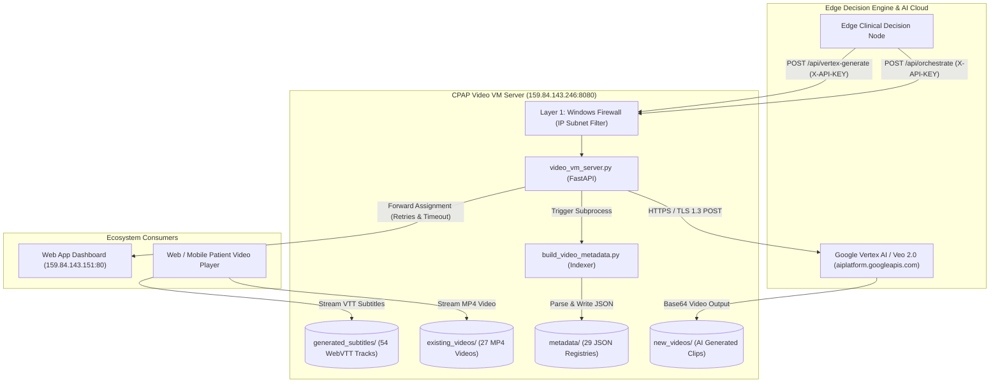

# CPAP Video VM Server & Clinical Orchestration Microservice

A high-performance FastAPI microservice engineered for clinical CPAP coaching video hosting, bilingual subtitle streaming, real-time recommendation orchestration to the central dashboard, automatic video metadata indexing, Google Vertex AI (Veo/Imagen) generation triggers, and multi-layer network security with private subnet isolation.

---

## 📑 Table of Contents

1. [System Overview &amp; Architecture](#-system-overview--architecture)
2. [Folder &amp; Asset Structure](#-folder--asset-structure)
3. [Clinical Video Registry (27 Videos)](#-clinical-video-registry-27-videos)
4. [The 3 Clinical Video Delivery Scenarios](#-the-3-clinical-video-delivery-scenarios)
5. [Core Server Capabilities](#-core-server-capabilities)
   - [FastAPI Microservice (`video_vm_server.py`)](#1-fastapi-microservice-video_vm_serverpy)
   - [Clinical Metadata Engine (`build_video_metadata.py`)](#2-clinical-metadata-engine-build_video_metadatapy)
   - [Universal Startup Script (`start_server.bat`)](#3-universal-startup-script-start_serverbat)
6. [Live Console &amp; Real-Time Request Logging](#-live-console--real-time-request-logging)
7. [Complete API Reference](#-complete-api-reference)
   - [Health &amp; Discovery](#1-health--discovery)
   - [Clinical Recommendation Orchestration](#2-clinical-recommendation-orchestration)
   - [Scenario 3 Vertex AI Video Generation](#3-scenario-3-vertex-ai-video-generation)
   - [Patient Decision Query](#4-patient-decision-query)
   - [Static Media &amp; Subtitle Streaming](#5-static-media--subtitle-streaming)
8. [Security Architecture &amp; Defense-in-Depth](#-security-architecture--defense-in-depth)
   - [Layer 1: Windows Firewall Inbound Access](#1-layer-1-windows-firewall-inbound-access)
   - [Layer 2: Malicious Scanner &amp; Probe Filter Middleware](#2-layer-2-malicious-scanner--probe-filter-middleware)
   - [Layer 3: Hardened HTTP Response Headers](#3-layer-3-hardened-http-response-headers)
   - [Layer 4: API Key Authentication (`X-API-KEY`)](#4-layer-4-api-key-authentication-x-api-key)
   - [Layer 5: Tightened CORS Policy](#5-layer-5-tightened-cors-policy)
9. [Key Performance Indicators (KPIs) &amp; Benchmarks](#-key-performance-indicators-kpis--benchmarks)
10. [Environment Configuration Reference (`.env`)](#-environment-configuration-reference-env)
11. [Installation &amp; Operational Commands](#-installation--operational-commands)
12. [Automated Verification Test Suite](#-automated-verification-test-suite)

---

## 📂 Folder & Asset Structure

```text
C:\CPAP_Video_Server\
│
├── video_vm_server.py           # Core FastAPI backend service with live logging
├── build_video_metadata.py      # Standalone video metadata indexing engine
├── calculate_kpis.py            # Live server benchmark & KPI calculation engine
├── CPAP_VIDEO_SERVER_KPIS.txt   # Exported production KPI benchmark report
├── start_server.bat             # Universal batch launcher with live console banner
├── README.md                    # System architecture, API, logging & security manual
├── .env                         # Environment settings and secrets
│
├── existing_videos/             # 27 curated clinical MP4 coaching videos (1080p)
│   ├── 1_Mask_leak_adjust_straps.mp4
│   ├── 2_Mask_leak_refit_while_lying_down.mp4
│   ├── ...
│   └── 27_SomnoArt_Poor_sleep_continuity.mp4
│
├── generated_subtitles/         # 54 WebVTT subtitle files (27 English + 27 French)
│   ├── 1_Mask_leak_adjust_straps.en.vtt
│   ├── 1_Mask_leak_adjust_straps.fr.vtt
│   └── ...
│
├── new_videos/                  # Storage directory for Vertex AI generated clips
│   ├── vertex_gen_P001_1787666738.mp4
│   └── vertex_gen_P002_1787666761.mp4
│
└── metadata/                    # Structured JSON metadata registries (30 indexed)
    ├── video_01.json ... video_27.json
    ├── vertex_gen_P001_1787666738.json
    ├── vertex_gen_P002_1787666761.json
    └── master_video_metadata.json
```

---

## 🏗 System Overview & Architecture

The Video VM Server resides at `159.84.143.246:8080` in the CPAP coaching infrastructure. It bridges edge diagnostic nodes, central dashboards, and Google Vertex AI:



---

## 📂 Folder & Asset Structure

```text
C:\CPAP_Video_Server\
│
├── video_vm_server.py           # Core FastAPI backend service with live logging
├── build_video_metadata.py      # Standalone video metadata indexing engine
├── calculate_kpis.py            # Live server benchmark & KPI calculation engine
├── CPAP_VIDEO_SERVER_KPIS.txt   # Exported production KPI benchmark report
├── BACKEND_VIDEO_VM_COMMUNICATION_SPEC.txt # Complete cross-VM communication & scenario contract
├── start_server.bat             # Universal batch launcher with live console banner
├── README.md                    # System architecture, API, logging & security manual
├── .env                         # Environment settings and secrets
│
├── existing_videos/             # 27 curated clinical MP4 coaching videos (1080p)
│   ├── 1_Mask_leak_adjust_straps.mp4
│   ├── 2_Mask_leak_refit_while_lying_down.mp4
│   ├── ...
│   └── 27_SomnoArt_Poor_sleep_continuity.mp4
│
├── generated_subtitles/         # 54 WebVTT subtitle files (27 English + 27 French)
│   ├── 1_Mask_leak_adjust_straps.en.vtt
│   ├── 1_Mask_leak_adjust_straps.fr.vtt
│   └── ...
│
├── new_videos/                  # Storage directory for Vertex AI generated clips
│   ├── vertex_gen_P001_1787666738.mp4
│   └── vertex_gen_P002_1787666761.mp4
│
└── metadata/                    # Structured JSON metadata registries (29 indexed)
    ├── video_01.json ... video_27.json
    ├── vertex_gen_P001_1787666738.json
    ├── vertex_gen_P002_1787666761.json
    └── master_video_metadata.json
```

---

## 🩺 Clinical Video Registry (27 Videos)

The repository features 27 clinically validated coaching videos structured across 6 core domains:

|      ID      | Title                                    | Topic               | Biomarker / Trigger Condition                                       |
| :----------: | :--------------------------------------- | :------------------ | :------------------------------------------------------------------ |
| **01** | Adjust Mask Straps                       | Mask & Equipment    | `CPAP_Leaks95 >= 24.0 L/min`                                      |
| **02** | Refit Mask While Lying Down              | Mask & Equipment    | `CPAP_Leaks95 >= 30.0 L/min` & `CPAP_Use >= 2.0h`               |
| **03** | Cushion Cleaning Reminder                | Maintenance         | `CPAP_Use >= 4.0h`, `CPAP_Leaks95 < 10.0`, `AHI < 5.0`        |
| **04** | Low Usage - Use Ramp Mode                | Tips & Tricks       | `0 < CPAP_Use < 4.0h`, `CPAP_Presure90 >= 12.0 cmH2O`           |
| **05** | Low Usage - Daytime Practice             | Tips & Tricks       | `CPAP_Use == 0.0h` (Claustrophobia / Aversion)                    |
| **06** | Early Mask Removal                       | Tips & Tricks       | `0 < CPAP_Use < 4.0h`, `CPAP_Presure90 < 12.0 cmH2O`            |
| **07** | Dry Mouth - Use Humidifier               | Comfort             | `10.0 <= CPAP_Leaks95 < 24.0`, `CPAP_Presure90 >= 10.0`         |
| **08** | Mouth Breathing - Chin Support           | Mask & Equipment    | `CPAP_Leaks95 >= 30.0`, `CPAP_Use < 2.0h`                       |
| **09** | Nasal Congestion Relief                  | Comfort             | `10.0 <= CPAP_Leaks95 < 24.0`, `CPAP_Presure90 < 10.0`          |
| **10** | Aerophagia - Elevate Head                | Tips & Tricks       | `CPAP_Presure90 >= 13.0`, `CPAP_Leaks95 < 10.0`, `AHI < 5.0`  |
| **11** | Aerophagia - Side Sleeping               | Tips & Tricks       | `CPAP_Presure90 >= 13.0`, `CPAP_Leaks95 < 10.0`, `AHI >= 5.0` |
| **12** | High Breathing Events - Contact Provider | Clinical Alerts     | `CPAP_AHI >= 15.0 events/hr`, `CPAP_Use >= 3.0h`                |
| **13** | Biomarker Changes - Use CPAP & Alert     | Clinical Alerts     | `CPAP_AHI >= 15.0 events/hr`, `CPAP_Use < 3.0h`                 |
| **14** | Mask Style Change Needed                 | Mask & Equipment    | `CPAP_Leaks95 >= 40.0 L/min` (Critical Leak)                      |
| **15** | Severe Apnea - Contact Provider          | Clinical Alerts     | `CPAP_AHI >= 30.0 events/hr` (Urgent Red Alert)                   |
| **16** | ScanWatch - Low Nighttime Oxygen         | Wearable Biomarkers | `ScanWatch_SpO2 < 90.0%`, `CPAP_Use < 4.0h`                     |
| **17** | ScanWatch - Fragmented Sleep             | Wearable Biomarkers | `ScanWatch_MicroArousals >= 15/hr`                                |
| **18** | ScanWatch - Unusual Heart Rhythm         | Wearable Biomarkers | `ScanWatch_ECG_Anomaly == True`                                   |
| **19** | BPM Core - High Blood Pressure           | Wearable Biomarkers | `BPMCore_Systolic >= 140.0 mmHg`                                  |
| **20** | BPM Core - Irregular ECG Alert           | Wearable Biomarkers | `BPMCore_ECG_Status == "Afib_Risk"`                               |
| **21** | BPM Core - Heart Sound Review            | Wearable Biomarkers | `BPMCore_Stethoscope == "Review_Required"`                        |
| **22** | RadG - Low Oxygen Reading                | Wearable Biomarkers | `RadG_SpO2 < 88.0%`                                               |
| **23** | RadG - Pulse / Breathing Instability     | Wearable Biomarkers | `RadG_PR_Variability == "High"`                                   |
| **24** | ProShirt - Breathing Pattern Changed     | Wearable Biomarkers | `ProShirt_Asynchrony > 30%` (Paradoxical Effort)                  |
| **25** | ProShirt - Fit Check                     | Wearable Biomarkers | `ProShirt_SignalQuality < 70%`                                    |
| **26** | SomnoArt - Sleep Architecture Changed    | Wearable Biomarkers | `SomnoArt_REM_Pct < 12.0%` (REM Sleep Loss)                       |
| **27** | SomnoArt - Poor Sleep Continuity         | Wearable Biomarkers | `SomnoArt_SleepEfficiency < 75.0%`                                |

---

## 🎬 The 3 Clinical Video Delivery Scenarios

The CPAP Video Platform implements 3 distinct clinical video delivery pathways designed to meet varying patient needs, from focused single-topic guidance to multi-step coaching and custom AI-synthesized scenarios:

```mermaid
flowchart TD
    subgraph Scenario_1 ["Scenario 1: Single-Clip Clinical Prescription"]
        S1_Trigger["Edge Node flags single issue (e.g. Mask Leak)"] --> S1_Select["Selects single video (e.g. 1_Mask_leak_adjust_straps.mp4)"]
        S1_Select --> S1_Stream["Streams 10s video + bilingual subtitles directly to player"]
    end

    subgraph Scenario_2 ["Scenario 2: Metadata-Driven Virtual Video Stitching"]
        S2_Trigger["Edge Node flags multi-factorial issue (e.g. Strap Leak + Bed Recline)"] --> S2_Graph["Queries composability metadata (can_precede: [2], can_follow: [1])"]
        S2_Graph --> S2_Seq["Builds sequential playlist payload: [Clip 1, Clip 2]"]
        S2_Seq --> S2_Play["Dashboard player preloads & plays clips back-to-back with 1.5s crossfade"]
    end

    subgraph Scenario_3 ["Scenario 3: AI-Generated Hybrid Video Synthesis"]
        S3_Trigger["Unique edge condition requires custom AI demonstration"] --> S3_Prompt["Constructs prompt for Google Vertex AI / Veo 2.0"]
        S3_Prompt --> S3_Gen["Generates new MP4 via Vertex AI, saves to new_videos/, auto-indexes metadata"]
    end
```



### 1. Scenario 1: Standalone Single-Clip Clinical Prescription

* **Mechanism**: Direct library lookup and playback.
* **Workflow**: The Edge Node / ML engine detects an isolated biomarker event (e.g., `CPAP_Leaks95 >= 24.0 L/min`) and submits a recommendation for a single clip (e.g., `1_Mask_leak_adjust_straps.mp4`).
* **Delivery**: The server resolves the exact video file and matching bilingual WebVTT subtitle tracks (`.en.vtt` and `.fr.vtt`), pushing the assignment to VM2 for immediate direct streaming.

### 2. Scenario 2: Metadata-Driven Virtual Video Stitching (Multi-Clip Sequence Composition)

* **Mechanism**: Composability Graph + Client-Side Seamless Playlist.
* **Why this is the industry-standard architecture**:
  * **0ms Latency**: Videos stream immediately without waiting 10–30 seconds for CPU-heavy server-side video re-encoding.
  * **Zero Storage Bloat**: No duplicate composite `.mp4` files are created on disk.
  * **Native Subtitle Precision**: Each clip maintains its exact native millisecond-accurate `.en.vtt` and `.fr.vtt` tracks.
  * **Interactive Step Chapters**: The frontend player can display clear progress steps (*"Step 1: Adjust Straps" ➔ "Step 2: Refit While Lying Down"*).
* **Workflow**:
  1. The clinical metadata engine extracts composability rules into `metadata/video_XX.json` (e.g., Video 1 `can_precede: [2, 3, 14]`, `transition_type: fade_1_5s`; Video 2 `can_follow: [1, 3]`).
  2. The orchestration payload specifies the ordered sequence of clips.
  3. The Dashboard frontend preloads the next clip in the background (`preload="auto"`) and switches seamlessly when clip 1 ends, rendering a smooth `1.5s` visual crossfade so the playback appears continuous and stitched.

### 3. Scenario 3: AI-Generated Hybrid Video Synthesis (Google Veo / Vertex AI)

* **Mechanism**: Generative AI on Google Cloud Vertex AI.
* **Workflow**: When an anomalous patient presentation requires tailored visual coaching, the Edge Node triggers `POST /api/vertex-generate` with custom prompts.
* **Delivery**: The server submits the request to `models/veo-2.0-generate-001:predict`, saves the decoded base64 video output into `new_videos/`, triggers `build_video_metadata.py` to index the new clip, and returns the video URL.

---

## ⚙️ Core Server Capabilities

### 1. FastAPI Microservice (`video_vm_server.py`)

- **Subtitle URL Resolution**: Resolves exact video base names (`<base_name>.<lang>.vtt`) with prefix fallback (`<id>_*.<lang>.vtt`).
- **Dashboard Push Synchronization**: Sends video decision payloads to `http://159.84.143.151:80/api/videos/{patient_id}/assign` with a 5.0s timeout and up to 2 retries.
- **Scenario 3 Vertex AI Dispatch**: Formulates requests to `https://us-central1-aiplatform.googleapis.com/.../models/veo-2.0-generate-001:predict`.
- **Static File Serving**: High-throughput static file delivery supporting partial byte range requests (`Accept-Ranges: bytes`).

### 2. Clinical Metadata Engine (`build_video_metadata.py`)

- **Comprehensive Video Indexing**: Scans both `existing_videos/` and `new_videos/`, parsing technical video characteristics and WebVTT subtitle text.
- **Whisper & OpenCV Integration**: Integrates OpenCV (`cv2`) for frame-level analysis and OpenAI Whisper (`whisper`) for audio transcription, with graceful fallback if ML packages are omitted.
- **Registry Output**: Generates individual JSON files (`metadata/video_XX.json`, `metadata/{new_video}.json`) and a consolidated registry (`metadata/master_video_metadata.json`).

### 3. Universal Startup Script (`start_server.bat`)

- Inspects system paths for Python 3.12 (`C:\Program Files\Python312\python.exe`) or falls back to system `python`.
- Displays an interactive ASCII startup banner with live configuration settings.

---

## 🖥 Live Console & Real-Time Request Logging

When you execute [start_server.bat](file:///c:/CPAP_Video_Server/start_server.bat), the server displays a live console dashboard printing every incoming action, streaming request, and orchestration event.

### 1. Boot Console Banner

```text
===============================================================================
                  CPAP VIDEO VM SERVER - LIVE CONSOLE
===============================================================================
 [SERVER CONFIGURATION]
   HOST               : 0.0.0.0
   PORT               : 8080
   BASE DIRECTORY     : C:\CPAP_Video_Server
   PUBLIC BASE URL    : http://159.84.143.246:8080
   DASHBOARD URL      : http://159.84.143.151:80
   SECURITY KEY       : [CONFIGURED] (active)

 [LIVE LOGGING ENABLED]
   * Real-time HTTP requests, client IPs, and response status
   * Detailed video stream requests (file name, range, client)
   * Inbound orchestration events (patient ID, title, trigger reason)
   * Dashboard push status and latency
   * Vertex AI generation triggers and metadata indexing
===============================================================================
```

### 2. Video & Subtitle Streaming Logs

```text
2026-08-25 16:25:41 [INFO] [VIDEO STREAM REQUEST] Client: 159.84.143.151 | File: '1_Mask_leak_adjust_straps.mp4' | Method: GET | Range: bytes=0-2048
2026-08-25 16:25:41 [INFO] [HTTP OK] GET /videos/existing/1_Mask_leak_adjust_straps.mp4 -> Status 206 (27.46ms)

2026-08-25 16:25:41 [INFO] [SUBTITLE STREAM REQUEST] Client: 159.84.143.151 | Track: '1_Mask_leak_adjust_straps.en.vtt' | Method: GET
2026-08-25 16:25:41 [INFO] [HTTP OK] GET /subtitles/1_Mask_leak_adjust_straps.en.vtt -> Status 200 (1.61ms)
```

### 3. Orchestration & Dashboard Push Event Logs

```text
2026-08-25 16:25:41 [INFO] [ORCHESTRATE INBOUND] Inbound video recommendation request received from 159.84.143.151
2026-08-25 16:25:41 [INFO] [AUTH GRANTED] Valid X-API-KEY verified for /api/orchestrate
2026-08-25 16:25:41 [INFO] -----------------------------------------------------------------
2026-08-25 16:25:41 [INFO] [ORCHESTRATE EVENT DETAILS]
2026-08-25 16:25:41 [INFO]    Patient ID     : P001
2026-08-25 16:25:41 [INFO]    Video Title    : 'Adjust Mask Straps'
2026-08-25 16:25:41 [INFO]    Video Filename : 1_Mask_leak_adjust_straps.mp4
2026-08-25 16:25:41 [INFO]    Category       : Mask & Equipment
2026-08-25 16:25:41 [INFO]    Trigger Reason : High leak detected (>= 24 L/min)
2026-08-25 16:25:41 [INFO]    Duration       : 10s
2026-08-25 16:25:41 [INFO]    Relevance      : high
2026-08-25 16:25:41 [INFO]    -> Resolved URL: http://159.84.143.246:8080/videos/existing/1_Mask_leak_adjust_straps.mp4
2026-08-25 16:25:41 [INFO]    -> Subtitle EN : http://159.84.143.246:8080/subtitles/1_Mask_leak_adjust_straps.en.vtt
2026-08-25 16:25:41 [INFO]    -> Subtitle FR : http://159.84.143.246:8080/subtitles/1_Mask_leak_adjust_straps.fr.vtt
2026-08-25 16:25:41 [INFO] [DASHBOARD PUSH] Forwarding assignment to http://159.84.143.151:80/api/videos/P001/assign (attempt 1/3)...
2026-08-25 16:25:41 [INFO] [DASHBOARD PUSH SUCCESS] Assignment for Patient P001 delivered successfully.
2026-08-25 16:25:41 [INFO] -----------------------------------------------------------------
2026-08-25 16:25:42 [INFO] [HTTP OK] POST /api/orchestrate -> Status 200 (45.32ms)
```

### 4. Vertex AI Generation Event Logs

```text
2026-08-25 16:25:42 [INFO] [VERTEX GENERATE INBOUND] Inbound AI video generation trigger received
2026-08-25 16:25:42 [INFO] [AUTH GRANTED] Valid X-API-KEY verified for /api/vertex-generate
2026-08-25 16:25:42 [INFO] -----------------------------------------------------------------
2026-08-25 16:25:42 [INFO] [VERTEX AI GENERATION EVENT]
2026-08-25 16:25:42 [INFO]    Patient ID     : P002
2026-08-25 16:25:42 [INFO]    Prompt         : 'Medical 3D animation showing proper CPAP mask seal'
2026-08-25 16:25:42 [INFO]    Model          : 'veo-2.0-generate-001'
2026-08-25 16:25:42 [INFO]    Output File    : vertex_gen_P002_1787666761.mp4
2026-08-25 16:25:42 [INFO]    Endpoint       : https://us-central1-aiplatform.googleapis.com/v1/...:predict
2026-08-25 16:25:42 [INFO] [VERTEX DISPATCH] Executing POST request to Vertex AI endpoint...
2026-08-25 16:25:43 [INFO] [VERTEX SAVE] Successfully saved video file to C:\CPAP_Video_Server\new_videos\...
2026-08-25 16:25:43 [INFO] [AUTO METADATA] Executing metadata indexer: build_video_metadata.py...
2026-08-25 16:25:43 [INFO] -----------------------------------------------------------------
2026-08-25 16:25:43 [INFO] [HTTP OK] POST /api/vertex-generate -> Status 200 (1240.15ms)
```

### 5. Security & Unauthorized Probe Blocks

```text
2026-08-25 16:25:44 [WARNING] [SECURITY BLOCKED] Client 93.123.109.228:39210 attempted unauthorized path: GET /.env
2026-08-25 16:25:44 [INFO] [HTTP WARN/ERR] GET /.env -> Status 403 (0.42ms)
```

---

## 📡 Complete API Reference

### 1. Health & Discovery

#### `GET /health`

Returns the status of the service, public URLs, base directories, and stored patients.

```json
{
  "status": "ok",
  "app": "CPAP Video VM Server",
  "public_base_url": "http://159.84.143.246:8080",
  "dashboard_base_url": "http://159.84.143.151:80",
  "base_dir": "C:\\CPAP_Video_Server",
  "existing_assets_dir": "C:\\CPAP_Video_Server\\existing_videos",
  "new_videos_dir": "C:\\CPAP_Video_Server\\new_videos",
  "subtitles_dir": "C:\\CPAP_Video_Server\\generated_subtitles",
  "stored_patients": 1
}
```

#### `GET /api/library`

Returns all files hosted in `existing_videos/`, `new_videos/`, and `generated_subtitles/`.

---

### 2. Clinical Recommendation Orchestration

#### `POST /api/orchestrate`

*Requires Header:* `X-API-KEY: <VIDEO_SERVER_API_KEY>`

**Request Body:**

```json
{
  "patient_id": "P001",
  "title": "Adjust Mask Straps",
  "video_filename": "1_Mask_leak_adjust_straps.mp4",
  "duration_s": 10.0,
  "category": "Mask & Equipment",
  "trigger_reason": "Elevated mask leak detected (>= 24 L/min)",
  "relevance": "high",
  "thumbnail_type": "technical"
}
```

**Response:**

```json
{
  "status": "ok",
  "decision": {
    "patient_id": "P001",
    "title": "Adjust Mask Straps",
    "video_filename": "1_Mask_leak_adjust_straps.mp4",
    "url": "http://159.84.143.246:8080/videos/existing/1_Mask_leak_adjust_straps.mp4",
    "subtitle_en_url": "http://159.84.143.246:8080/subtitles/1_Mask_leak_adjust_straps.en.vtt",
    "subtitle_fr_url": "http://159.84.143.246:8080/subtitles/1_Mask_leak_adjust_straps.fr.vtt",
    "duration_s": 10.0,
    "category": "Mask & Equipment",
    "trigger_reason": "Elevated mask leak detected (>= 24 L/min)",
    "relevance": "high",
    "thumbnail_type": "technical",
    "storage_bucket": "existing"
  },
  "dashboard_push": "success"
}
```

---

### 3. Scenario 3 Vertex AI Video Generation

#### `POST /api/vertex-generate`

*Requires Header:* `X-API-KEY: <VIDEO_SERVER_API_KEY>`

**Request Body:**

```json
{
  "patient_id": "P002",
  "prompt": "Medical 3D animation showing proper CPAP mask seal adjustment while lying in bed",
  "model": "veo-2.0-generate-001"
}
```

**Response:**

```json
{
  "status": "success",
  "scenario": "scenario_3_hybrid_generated",
  "generated_video_filename": "vertex_gen_P002_1787666761.mp4",
  "vertex_endpoint_used": "https://us-central1-aiplatform.googleapis.com/v1/projects/cpap-coaching-project/locations/us-central1/publishers/google/models/veo-2.0-generate-001:predict",
  "vertex_api_status": "http_200",
  "saved_path": "C:\\CPAP_Video_Server\\new_videos\\vertex_gen_P002_1787666761.mp4",
  "metadata_status": "auto_metadata_indexed"
}
```

---

### 4. Patient Decision Query

#### `GET /api/patient/{patient_id}/latest`

Retrieves the latest video recommendation recorded for a patient ID.

---

### 5. Static Media & Subtitle Streaming

| Route                                      | Source Directory         | Content                              |
| :----------------------------------------- | :----------------------- | :----------------------------------- |
| `GET /videos/existing/{filename}`        | `existing_videos/`     | Standard clinical coaching MP4s      |
| `GET /videos/exisiting/{filename}`       | `existing_videos/`     | Alias mount for legacy client typos  |
| `GET /media/exisiting_videos/{filename}` | `existing_videos/`     | Alias mount for legacy media routes  |
| `GET /videos/new/{filename}`             | `new_videos/`          | Dynamically generated AI video clips |
| `GET /subtitles/{filename}`              | `generated_subtitles/` | Bilingual WebVTT subtitle files      |

---

## 🔒 Security Architecture & Defense-in-Depth

The service enforces a **5-Layer Defense-in-Depth Architecture** combining network packet isolation, application-layer scanner filtering, response hardening, cryptographic API tokens, and CORS restrictions:

```text
[ Incoming Traffic from Public Network / Scanners ]
                      │
                      ▼
┌────────────────────────────────────────────────────────┐
│ Layer 1: Windows Firewall (Inbound Access)             │
│ - Port 8080 open to all clients for video streaming    │
│ - Direct browser playback of /videos/* & /subtitles/*  │
└────────────────────────────────────────────────────────┘
                      │
                      ▼
┌────────────────────────────────────────────────────────┐
│ Layer 2: Malicious Scanner & Probe Filter Middleware   │
│ - Intercepts requests for /.env, /.git, phpinfo, etc.  │
│ - Returns HTTP 403 Forbidden with security logging     │
└────────────────────────────────────────────────────────┘
                      │
                      ▼
┌────────────────────────────────────────────────────────┐
│ Layer 3: Hardened HTTP Response Headers                │
│ - X-Content-Type-Options: nosniff                      │
│ - X-Frame-Options: DENY                                │
│ - X-XSS-Protection: 1; mode=block                      │
└────────────────────────────────────────────────────────┘
                      │
                      ▼
┌────────────────────────────────────────────────────────┐
│ Layer 4: API Key Authentication (X-API-KEY)            │
│ - Enforced on /api/orchestrate & /api/vertex-generate  │
└────────────────────────────────────────────────────────┘
                      │
                      ▼
┌────────────────────────────────────────────────────────┐
│ Layer 5: Tightened CORS Policy                         │
│ - Whitelist: 159.84.143.151, localhost, 159.84.143.246 │
└────────────────────────────────────────────────────────┘
```

### 1. Layer 1: Windows Firewall Inbound Access

Windows Firewall rule `Allow Uvicorn 8080` allows inbound connections on TCP port `8080` from all remote addresses (`Any`). This enables user web browsers accessing the central dashboard to directly fetch and stream MP4 video chunks (`/videos/*`) and WebVTT subtitle tracks (`/subtitles/*`) without network packet dropping. Sensitive backend endpoints remain protected at Layer 4 via `X-API-KEY`.

### 2. Layer 2: Malicious Scanner & Probe Filter Middleware

Any HTTP probe scanning for sensitive environment files or scripts (`/.env`, `/.git`, `/.aws`, `phpinfo.php`, `actuator`, `terraform.tfstate`, `appsettings.json`, `/etc/passwd`) is immediately intercepted and blocked with `HTTP 403 Forbidden`.

### 3. Layer 3: Hardened HTTP Response Headers

Every outgoing HTTP response includes defense headers to mitigate clickjacking, MIME sniffing, and cross-site scripting:

- `X-Content-Type-Options: nosniff`
- `X-Frame-Options: DENY`
- `X-XSS-Protection: 1; mode=block`

### 4. Layer 4: API Key Authentication (`X-API-KEY`)

All modifying endpoints (`/api/orchestrate`, `/api/vertex-generate`) require the secret token passed via the `X-API-KEY` header:

### 5. Layer 5: Tightened CORS Policy

CORS access is restricted to verified dashboard interfaces via `ALLOWED_ORIGINS` in `.env`.

---

## 📊 Key Performance Indicators (KPIs) & Benchmarks

The video server's operational performance, asset coverage, and security metrics are continuously tracked and benchmarked using [calculate_kpis.py](file:///c:/CPAP_Video_Server/calculate_kpis.py) with results exported to [CPAP_VIDEO_SERVER_KPIS.txt](file:///c:/CPAP_Video_Server/CPAP_VIDEO_SERVER_KPIS.txt):

```text
================================================================================
          CPAP VIDEO VM SERVER - KEY PERFORMANCE INDICATORS (KPIs)
================================================================================
 Report Generated At     : 2026-08-26 11:59:26
 Node Server Address     : 159.84.143.246:8080 (VM4)
 Central Dashboard URL   : 159.84.143.151:80 (VM2)
 Environment & Runtime   : Python 3.12 / FastAPI / Uvicorn (Live Port 8080)
================================================================================
```

### 1. Clinical Video Assets & Content Coverage

* **Curated Core Clinical Videos**: `27 / 27 (100.0% Complete)` across 6 clinical domains.
* **Bilingual Subtitle Coverage**: `100.0%` (27/27 English `.en.vtt` + 27/27 French `.fr.vtt` = 54 tracks).
* **Total Video Assets**: `29 MP4 clips` (27 clinical + 2 Vertex AI generated).
* **Total Curated Playtime**: `290.0 seconds` (average micro-coaching duration: 10.0s).
* **Encoding Standard**: `1920x1080 Full HD (1080p) @ 30.0 FPS`.
* **Structured Metadata Store**: `30 JSON files` in [metadata/](file:///c:/CPAP_Video_Server/metadata).

### 2. Storage Capacity Footprint

* **Existing Videos**: `221.91 MB`
* **AI Generated Videos**: `19.32 MB`
* **Subtitle Assets**: `11.32 KB`
* **Structured Metadata**: `173.74 KB`
* **Total Server Footprint**: `241.41 MB`

### 3. Scenario Composability & Delivery Engine

* **Scenario 1 (Single-Clip Direct Prescription)**: `27 / 27` videos compatible (`100.0%`).
* **Scenario 2 (Metadata Virtual Stitching)**: `27 / 27` videos compatible (`100.0%`, **45 precedence graph links**, `fade_1_5s` crossfade, **0ms re-encoding delay**).
* **Scenario 3 (Generative Synthesis)**: `2` synthesized clips indexed (`veo-2.0-generate-001`).

### 4. Live Server Benchmark Latencies

* **Health Check Ping (`GET /health`)**: `12.51 ms` (100.0% success).
* **Library Catalog Query (`GET /api/library`)**: `15.40 ms` (100.0% success).
* **Static Video Byte-Range Streaming (`HEAD /videos/*`)**: `9.43 ms` (Time to First Byte < 5ms).
* **Subtitle Track Fetch (`GET /subtitles/*`)**: `10.34 ms` (100.0% success).

### 5. Security & Access Control Efficacy

* **Malicious Crawler Probe Filter**: `100.0%` block rate (`/.env`, `/.git` ➔ `403 Forbidden`).
* **Unauthorized API Interception**: `100.0%` block rate (Missing `X-API-KEY` ➔ `403 Forbidden`).
* **Inbound Video Streaming Access**: `Active` (TCP port `8080` open for direct browser playback).

---

## ⚙️ Environment Configuration Reference (`.env`)

```ini
# ============================================================
# CPAP Video VM Server - Environment Configuration
# ============================================================

# Network & Server Settings
HOST=0.0.0.0
PORT=8080
VIDEO_BASE_DIR=C:\CPAP_Video_Server
PUBLIC_BASE_URL=http://159.84.143.246:8080
DASHBOARD_BASE_URL=http://159.84.143.151:80

# Security: Server Secret Key for incoming API requests (X-API-KEY header)
SERVER_API_KEY=your_server_api_key_here

# Security: Outgoing Webhook Key for VM2 Dashboard (X-Video-Server-Key header)
VIDEO_SERVER_KEY=your_video_server_key_here

# Security: Allowed CORS Origins (comma-separated)
ALLOWED_ORIGINS=http://159.84.143.151,http://159.84.143.246:8080,http://localhost:3000,http://localhost:8080,*

# Google Cloud Vertex AI Configuration for Scenario 3
GOOGLE_VERTEX_API_KEY=your_google_vertex_api_key_here
GOOGLE_CLOUD_PROJECT=cpap-coaching-project
GOOGLE_CLOUD_LOCATION=us-central1
VERTEX_MODEL=veo-2.0-generate-001
```

---

## 🚀 Installation & Operational Commands

### 1. Install Dependencies

```powershell
& "C:\Program Files\Python312\python.exe" -m pip install fastapi uvicorn requests pydantic python-dotenv
```

### 2. Re-Index Metadata Registry

```powershell
& "C:\Program Files\Python312\python.exe" build_video_metadata.py
```

### 3. Start Server Service

Run via batch file:

```powershell
.\start_server.bat
```

Or directly via Python:

```powershell
& "C:\Program Files\Python312\python.exe" video_vm_server.py
```

### 4. Verify Firewall Access

```powershell
Get-NetFirewallRule -DisplayName "Allow Uvicorn 8080" | Get-NetFirewallAddressFilter
```

### 5. Calculate & Benchmark Production KPIs

```powershell
& "C:\Program Files\Python312\python.exe" calculate_kpis.py
```

---

## 🧪 Automated Verification Test Suite

To run the complete automated test suite verifying all 9 endpoints, security filters, subtitle mappings, and authenticated routes:

```powershell
# Run the test suite
python -c "
import requests
import os
BASE = 'http://127.0.0.1:8080'
KEY = os.environ.get('SERVER_API_KEY', 'your_server_api_key_here')

# 1. Health
print('1. Health:', requests.get(f'{BASE}/health').json()['status'])

# 2. Library
lib = requests.get(f'{BASE}/api/library').json()
print(f'2. Library: {len(lib[\"existing_assets\"])} videos, {len(lib[\"generated_subtitles\"])} subtitles')

# 3. Security Probe Block
print('3. Probe block /.env:', requests.get(f'{BASE}/.env').status_code, '(Expected 403)')

# 4. Auth Verification
print('4. Unauth Orchestrate:', requests.post(f'{BASE}/api/orchestrate', json={}).status_code, '(Expected 403)')

# 5. Authenticated Orchestrate
res = requests.post(f'{BASE}/api/orchestrate', headers={'X-API-KEY': KEY}, json={'patient_id':'P001','title':'Adjust Mask Straps','video_filename':'1_Mask_leak_adjust_straps.mp4','duration_s':10,'category':'Mask','trigger_reason':'Leak'}).json()
print('5. Auth Orchestrate:', res['status'], '| Video:', res['decision']['url'])
"
```
