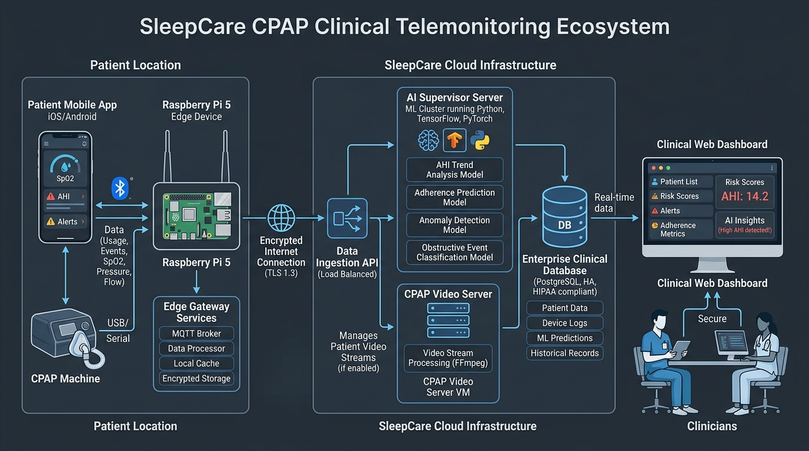

# SleepCare CPAP — Just-in-Time Clinical Coaching & Multimodal AI Telemonitoring

> **A collaborative research initiative by DISP Laboratory (Lyon) & Linde HomeCare France**  
> *Autonomous Closed-Loop Telemonitoring, 7-Layer AI Adherence Prediction, and Dynamic 1080p Video Coaching for Obstructive Sleep Apnea (OSA)*

[](https://www.python.org/)
[](https://fastapi.tiangolo.com/)
[-E11D48.svg)](#)
[-10B981.svg)](#)
[](#)
[](#)

---

## 📖 Overview

The **SleepCare CPAP Ecosystem** provides autonomous, 24/7 closed-loop telemonitoring and personalized audiovisual clinical coaching for patients receiving Continuous Positive Airway Pressure (CPAP) therapy. It bridges the gap between raw device telemetry (CPAP machine usage, mask leak, residual AHI, plus 5 continuous wearable biomarker streams) and long-term therapy adherence.

The architecture was validated in clinical cohort studies (41,117 patients) and demonstrated live at stakeholder showcases in **Berlin**, achieving sub-second intervention delivery over simulated 5G Quality on Demand (QoD) network slices.



---

## 📂 Repository Organization

```text
CPAP new/
├── CPAP_Raspberry_Pi/        # Edge computing node runtime (Raspberry Pi 5)
│   ├── app.py                # FastAPI edge service (:8000), ingest & RTT timing
│   ├── edge_detection.py     # 37-rule deterministic clinical anomaly triage engine
│   ├── load_library.py       # Startup video indexer & Scenario 1/2/3 decision trees
│   └── .env.example          # Environment template for edge runtime
│
├── CPAP_Video_Server/        # Media streaming & generative AI synthesis node (VM4)
│   ├── video_vm_server.py    # FastAPI service (:8080) with HTTP 206 byte-range seeking
│   ├── deduplication_engine.py# 3-level in-memory pre-gen deduplication shield (<1ms)
│   ├── assignment_ledger.py  # Atomic thread-safe persistent assignment ledger
│   ├── dashboard/            # Interactive clinical operations console & subtitle overlay
│   ├── existing_videos/      # 37 Curated Full HD 1080p coaching videos
│   ├── new_videos/           # 2 AI-generated Full HD 1080p coaching videos (Veo 3.1)
│   ├── existing_subtitles/   # 74 WebVTT bilingual subtitle tracks (EN & FR)
│   ├── new_subtitles/        # 4 WebVTT bilingual subtitle tracks (EN & FR)
│   └── .env.example          # Environment template for Video VM
│
├── CPAP_AI_Server/           # 7-layer machine learning supervisor & analytics (VM3)
│   ├── core/                 # Modular AI supervisor package (server, pipeline, engine)
│   ├── M4_FINAL_F2.ipynb     # Authoritative 7-layer ML intelligence pipeline (Layers 0-6)
│   ├── artifacts/            # Model outputs, persistent tracker (9,676+ patients)
│   ├── scripts/              # Pre-flight TCP port scanner & KPI benchmark engine
│   └── .env.example          # Environment template for AI supervisor
│
├── docs/                     # Comprehensive technical documentation & handover suite
│   ├── HANDOVER_REPORT.md    # Master handover report for incoming engineers
│   ├── ARCHITECTURE.md       # End-to-end system topology & latency pipeline (t0-t7)
│   ├── COMPONENTS.md         # Deep-dive breakdown of all 4 architectural pillars
│   ├── CODEBASE_MAP.md       # Exhaustive file-by-file directory guide
│   ├── API.md                # Unified REST API reference & code recipes
│   ├── ROUTES.md             # Complete route & endpoint catalog
│   ├── STATE.md              # State persistence, atomic swap ledgers & caching
│   ├── DEPLOYMENT.md         # Production runbooks & service deployment
│   └── DEVELOPMENT.md        # Local workflows, automated testing & adding videos
│
└── .gitignore                # Security filter preventing accidental secrets commits
```

---

## 🚀 Quick Start Guide

### 1. Configure Environment Secrets
All sensitive keys and production tokens have been stripped for public release. Create local `.env` configuration files from the provided templates:

```bash
# On Raspberry Pi Edge:
cp "CPAP_Raspberry_Pi/.env.example" "CPAP_Raspberry_Pi/.env"

# On Video VM Server:
cp "CPAP_Video_Server/.env.example" "CPAP_Video_Server/.env"

# On AI Supervisor Server:
cp "CPAP_AI_Server/.env.example" "CPAP_AI_Server/.env"
```

Fill in your respective API keys (`SERVER_API_KEY`, `BACKEND_API_KEY`, `GOOGLE_VERTEX_API_KEY`, etc.) inside each `.env`.

### 2. Launching Services

#### A. Raspberry Pi Edge Node (Port 8000)
```bash
cd "CPAP_Raspberry_Pi"
python3 -m venv .venv
source .venv/bin/activate
pip install -r requirements.txt
uvicorn app:app --host 0.0.0.0 --port 8000
```

#### B. CPAP Video Server (Port 8080)
```powershell
cd CPAP_Video_Server
.\start_server.bat
```
*Access the local Clinical Operations Console at `http://localhost:8080/`.*

#### C. CPAP AI Supervisor Server (Port 8000 & 8001)
```powershell
cd CPAP_AI_Server
.\run_ai_server.bat
```
*Access the interactive AI Surveillance Dashboard at `http://localhost:8000/dashboard`.*

---

## 🔒 Security & Privacy Notice

- **Public Repository Security**: All production authentication tokens, bearer secrets, and Google Vertex AI keys have been purged and replaced with environment variables.
- **Git Protection**: The root [`.gitignore`](file:///.gitignore) strictly prevents `.env`, `*.log`, and raw patient ingestion data from being committed.
- **Healthcare Compliance**: Patient identifiers (`AtHomePatientId`) are pseudonymous. The platform complies with European GDPR and French HDS (Hébergeur de Données de Santé) healthcare regulations.

---

## 📚 Complete Technical Documentation

For in-depth architectural specifications, API schemas, and deployment instructions, consult the **[docs/](file:///docs/)** directory:
- **[Master Technical Handover Report](docs/HANDOVER_REPORT.md)**
- **[System Architecture & Latency Pipeline](docs/ARCHITECTURE.md)**
- **[Component Deep Dive](docs/COMPONENTS.md)**
- **[Codebase Map](docs/CODEBASE_MAP.md)**
- **[Unified REST API Manual](docs/API.md)**
- **[Exhaustive Route Catalog](docs/ROUTES.md)**
- **[State & Deduplication Caches](docs/STATE.md)**
- **[Production Deployment Runbooks](docs/DEPLOYMENT.md)**
- **[Developer Onboarding & Test Suite](docs/DEVELOPMENT.md)**

---

*DISP Laboratory (Lyon) & Linde HomeCare France — CPAP Telemonitoring Research Group*
