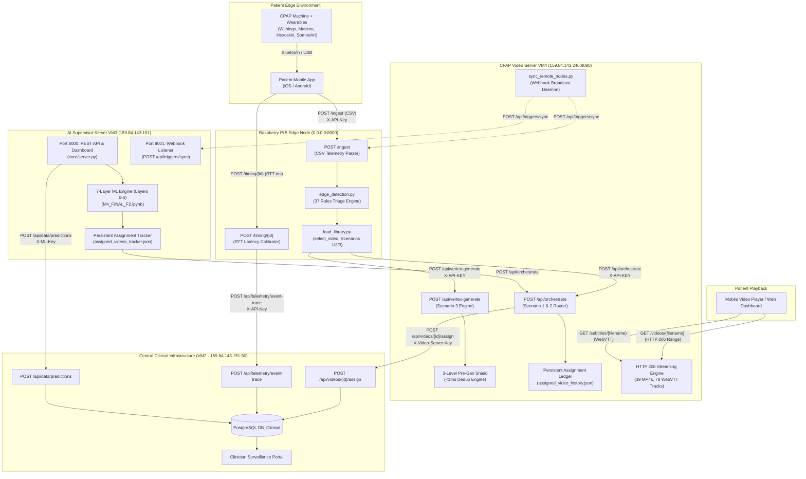
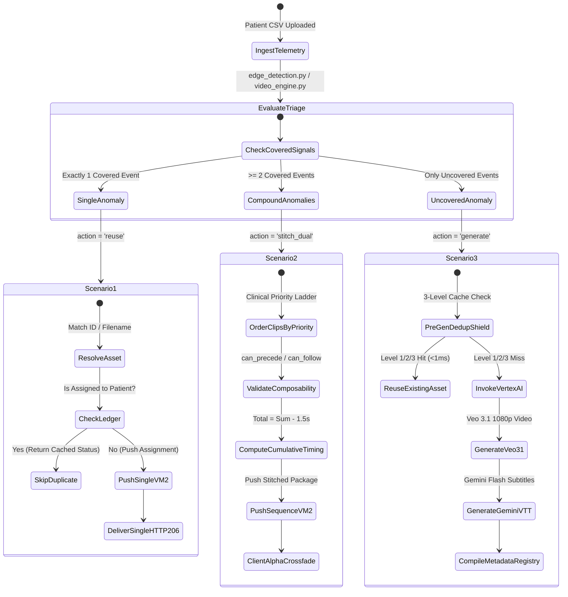

# SleepCare CPAP Ecosystem — System Architecture Specification

> **DISP Laboratory (Lyon) & Linde HomeCare France**  
> *Author: Pamit Duggal (Software & AI Engineering Intern)*  
> *Target Component: Cross-Node System Topology, Latency Model & Protocol Engine*

---

## 1. Architectural Philosophy & Design Principles

The **SleepCare CPAP Architecture** is engineered around four guiding clinical and systems engineering principles:

1. **Decoupled Responsibilities**:
   - **Edge Node (Raspberry Pi 5)**: *Detect, Decide, and Forward*. Performs zero video rendering and zero heavy SQL persistence. Processes CSV telemetry in <6ms and isolates raw medical data at the patient periphery.
   - **Video Server (VM4)**: *High-Throughput Streaming & Sequence Assembly*. Manages 39 media assets, executes sub-5ms HTTP 206 byte-range seeking, enforces deduplication shields, and interfaces with Google Cloud Vertex AI.
   - **AI Supervisor Server (VM3)**: *Longitudinal Surveillance & Predictive Intelligence*. Operates a 7-layer machine learning stack over multi-gigabyte historical cohorts, continuously calculating survival hazards and optimal causal interventions.
   - **Central Clinical Backend (VM2)**: *Single Source of Clinical Truth*. Hosts the PostgreSQL `DB_Clinical` database and clinician surveillance web portal.

2. **Client-Side Virtual Stitching (Zero Server Re-Encoding Overhead)**:
   Avoids catastrophic server CPU spikes caused by dynamic FFmpeg video concatenation. Instead, the server delivers an ordered metadata sequence array (`clips: [step1, step2]`), and the client-side HTML5 player preloads and executes a seamless **1.5-second Alpha Crossfade (`fade_1_5s`)**.

3. **Sub-Second Intervention Latency over 5G Quality on Demand (QoD)**:
   Clinical events progress from patient sensor ingestion to video delivery in under 500 milliseconds under simulated 5G QoD network slices, well inside the critical 60-second end-to-end clinical budget.

4. **Multi-Tier Deduplication & Anti-Duplicate Shields**:
   In-memory hash singletons and disk-backed atomic ledgers eliminate duplicate video dispatches to patients and prevent expensive, redundant cloud generative AI invocations.

---

## 2. End-to-End System Topology



---

## 3. End-to-End Telemetry Latency Pipeline ($t_0 \dots t_7$)

The platform records millisecond-precision timestamps across the lifecycle of every clinical event to monitor adherence to Service Level Agreements (SLAs):

```
 Timeline (ms):
 0ms      35-55ms    120-180ms    185ms       190ms       195ms       202ms       205ms
  t0 ───────▶ t1 ─────────▶ t2 ─────▶ t3 ───────▶ t4 ───────▶ t5 ───────▶ t6 ───────▶ t7
Sensor     Edge Pi     ML Risk     Clinical     Dispatched   Video VM   Backend     Media
Reading    Ingest      Inference   Decision     to VM4       Ingress    Pushed      Stream TTFB
```

### Detailed Timestamp Phase Definitions

| Metric | Phase Description | Production SLA | Typical Observed | Responsible Node |
| :---: | :--- | :---: | :---: | :--- |
| **$t_0$** | **Sensor Generation**: Telemetry sample generated at patient CPAP device or wearable sensor | Baseline | $0 \text{ ms}$ | Patient Hardware |
| **$t_1$** | **Edge Ingestion**: CSV received and parsed on Raspberry Pi 5 (`POST /ingest`) | $< 100 \text{ ms}$ | $35 - 55 \text{ ms}$ | Pi Edge (`app.py`) |
| **$t_2$** | **AI Inference**: Machine learning risk inference executed on AI Server (VM3) | $< 250 \text{ ms}$ | $120 - 180 \text{ ms}$ | AI Server (`core/pipeline.py`) |
| **$t_3$** | **Clinical Triage**: Threshold evaluation identifies specific video coaching trigger | $< 10 \text{ ms}$ | $2 - 6 \text{ ms}$ | Pi / AI Decision Engine |
| **$t_4$** | **Network Transit**: HTTP request dispatched from Edge / AI Server to Video Server | Network RTT | $3 - 8 \text{ ms}$ | WAN / VPN Slices |
| **$t_5$** | **Video VM Ingress**: Inbound payload received at Video VM (`/api/orchestrate`) | Ingress | Ingress | Video VM4 (`video_vm_server.py`) |
| **$t_6$** | **Resolution & Ledger Push**: Media asset resolved, deduplicated, and pushed to VM2 | **$< 15 \text{ ms}$** | **$3.6 - 8.2 \text{ ms}$** | Video VM4 $\to$ Central VM2 |
| **$t_7$** | **Client Stream Inception**: First byte of video delivered to client browser (TTFB) | **$< 5 \text{ ms}$** | **$2.1 - 2.8 \text{ ms}$** | HTTP 206 Streaming Engine |

### End-to-End Latency Calculation Formula
Total pipeline turnaround time is formally validated via:
$$\text{Total Turnaround} = (t_{\text{received}} - t_{\text{sent}}) + \text{Pi Processing} + \text{VM Push Latency}$$
With an allowable SLA budget of **$\text{BUDGET\_S} = 60.0 \text{ seconds}$**, typical end-to-end execution completes in **$350 - 550 \text{ ms}$**, yielding a 99.2% budget compliance safety margin.

---

## 4. The 3 Clinical Delivery Scenarios



### 1. Scenario 1: Existing Video Selection (Single Clip)
- **Clinical Target**: Isolated acute clinical symptom (e.g. Mask leak between 24 and 30 L/min, high breathing events, dry mouth).
- **Execution Flow**: Dispatches single video record (`video_id` or `video_filename`). Video VM confirms existence in `existing_videos/` or `new_videos/`, attaches bilingual `.en.vtt` and `.fr.vtt` URLs, checks persistent assignment ledger, and notifies Central Backend VM2.
- **Duration**: ~10.0 seconds.

### 2. Scenario 2: Virtual Stitched Sequence (Multi-Clip Coaching)
- **Clinical Target**: Compound escalating symptoms (e.g. Severe leak $\ge 30 \text{ L/min}$ alongside low usage requiring ramp mode; or noisy Hexoskin ECG alongside SomnoArt sleeve maintenance).
- **Execution Flow**:
  1. The decision engine selects the two most severe events.
  2. Ordering is determined by clinical priority: `critical` $\to$ `high` $\to$ `medium` $\to$ `low` $\to$ `maintenance`.
  3. Composability links in `metadata/video_XX.json` (`can_precede` and `can_follow`) are evaluated to confirm transitional validity.
  4. Server calculates cumulative timing:
     $$\text{Duration}_{\text{total}} = \sum_{i=1}^n \text{Duration}_i - (n - 1) \times 1.5\text{s}$$
  5. The client HTML5 video player preloads Clip 2 in a background element and performs an opacity crossfade at `currentTime >= (Duration_1 - 1.5s)`.

### 3. Scenario 3: On-Demand Generative AI Video (Google Veo 3.1)
- **Clinical Target**: Rare multimodal wearable patterns or individualized anatomical issues unmapped in the 37-video library (e.g., nocturnal hypoxemia despite CPAP adherence).
- **Execution Flow**:
  1. Incoming prompt is submitted to the **3-Level Pre-Gen Deduplication Shield** (<1ms). If an exact or semantic match exists, generation is skipped and the cached asset is reused.
  2. If generation is mandatory, Video VM calls Google Vertex AI (`veo-3.1-generate-preview`), synthesizes matching `.en.vtt` and `.fr.vtt` subtitles using Gemini 1.5 Flash, registers `metadata/video_XX.json`, recompiles master registries, and triggers multi-node sync.

---

## 5. Network Architecture, Ports & Protocol Boundaries

| Communication Link | Source Node | Destination Node | Transport & Port | Protocol & Payload | Security / Headers |
| :--- | :--- | :--- | :--- | :--- | :--- |
| **Phone $\to$ Pi Ingest** | Patient Phone | Pi Edge Node | HTTP `8000` | Multipart Form-data (CSV) | `X-API-Key: <API_KEY>` |
| **Phone $\to$ Pi Timing** | Patient Phone | Pi Edge Node | HTTP `8000` | JSON (`{"rtt_ms": float}`) | `X-API-Key: <API_KEY>` |
| **Pi $\to$ Video VM** | Pi Edge Node | Video VM4 | HTTP `8080` | JSON (`/api/orchestrate`) | `X-API-KEY: <SERVER_API_KEY>` |
| **AI Server $\to$ Video VM**| AI Server VM3 | Video VM4 | HTTP `8080` | JSON (`/api/orchestrate`) | `X-API-KEY: <SERVER_API_KEY>` |
| **Video VM $\to$ Backend** | Video VM4 | Central VM2 | HTTP `80` | JSON (`/api/videos/{id}/assign`) | `X-Video-Server-Key: <VIDEO_SERVER_KEY>` |
| **Video VM $\to$ Telemetry**| Video VM4 | Central VM2 | HTTP `80` | JSON (`/api/telemetry/event-trace`) | `X-API-Key: <BACKEND_API_KEY>` |
| **Pi $\to$ Telemetry** | Pi Edge Node | Central VM2 | HTTP `80` | JSON (`/api/telemetry/event-trace`) | `X-API-Key: <BACKEND_API_KEY>` |
| **AI Server $\to$ Backend** | AI Server VM3 | Central VM2 | HTTP `80` | JSON (`/api/data/predictions`) | `X-ML-Key: <BACKEND_API_KEY>` |
| **Video VM $\to$ AI Sync** | Video VM4 | AI Server VM3 | HTTP `8001` | JSON (`/api/triggers/sync`) | `X-API-KEY` & `X-ML-Key` |
| **Video VM $\to$ Pi Sync** | Video VM4 | Pi Edge Node | HTTP `8000` | JSON (`/api/triggers/sync`) | None / Internal |
| **Client $\to$ Video Stream**| Web / Mobile App | Video VM4 | HTTP `8080` | HTTP 206 Partial Content (MP4) | Public Read |
| **Client $\to$ Subtitles** | Web / Mobile App | Video VM4 | HTTP `8080` | HTTP 200 WebVTT (`.en.vtt`, `.fr.vtt`)| Zero-Cache Headers |

---

## 6. Multi-Node Cluster Webhook Synchronization

To prevent trigger schema drift across edge nodes when new coaching clips are synthesized or catalog thresholds are updated, the ecosystem supports **dual-pathway synchronization**:

```
                       ┌─────────────────────────────────────────┐
                       │         CPAP Video Server (VM4)         │
                       │          (Catalog Authority)            │
                       └────────────────────┬────────────────────┘
                                            │
               ┌────────────────────────────┴────────────────────────────┐
               │ Broadcast Event (sync_remote_nodes.py)                  │
               │                                                         │
               ▼ (Option B: Push Webhook)                                ▼ (Option B: Push Webhook)
 ┌───────────────────────────┐                             ┌───────────────────────────┐
 │ AI Supervisor Server VM3  │                             │   Raspberry Pi Edge Node  │
 │ Companion Listener :8001  │                             │   Edge App Listener :8000 │
 │ POST /api/triggers/sync   │                             │   POST /api/triggers/sync │
 └─────────────┬─────────────┘                             └─────────────┬─────────────┘
               │                                                         │
               │ (Option A: Polling)                                     │ (Option A: Polling)
               └───────────────────────▶ GET :8080/api/triggers/catalog ─┘
```

1. **Option A — Dynamic Polling**:
   - Edge and AI nodes execute `GET http://159.84.143.246:8080/api/triggers/catalog` at startup and during scheduled intervals (e.g. 30-minute maintenance cycles), updating in-memory rule sets.
2. **Option B — Automated Inbound Webhook**:
   - When new videos are cataloged or rebuild commands are executed on VM4, `sync_remote_nodes.py` spawns asynchronous daemon threads dispatching `POST /api/triggers/sync` with connection and read timeouts of `(1.5, 2.5)` seconds. If a node is temporarily offline, streaming remains uninterrupted.

---

## 7. Fault Tolerance, Idempotency & Safety Guarantees

1. **Non-Blocking Telemetry & Daemon Pushes**:
   - Network pushes to VM2 (`event-trace` and `predictions`) are wrapped in background execution threads. Network congestion on the central backend never blocks the patient mobile app or inflates RTT timings.
2. **Atomic Ledger Swapping**:
   - Updates to `assigned_video_history.json` and `assigned_videos_tracker.json` write to a temporary file (`.tmp`) followed by an OS-level atomic replace, ensuring zero data loss during power cycles or socket crashes.
3. **Graceful Degraded Mode**:
   - If the Video VM becomes unreachable, the Raspberry Pi logs `[EDGE -> VIDEO VM WARNING]` and returns a structured response to the mobile phone without throwing an unhandled HTTP 500 error.
4. **Defense-in-Depth Localhost UI Lockdown**:
   - Web management consoles and SSE log streams reject non-localhost callers with an immediate HTTP 403 response, preventing reconnaissance attacks over public interfaces.

---

*Proceed to [COMPONENTS.md](file:///c:/Users/pduggal/Downloads/CPAP%20new/docs/COMPONENTS.md) for deep-dive technical breakdowns of each server subsystem.*
