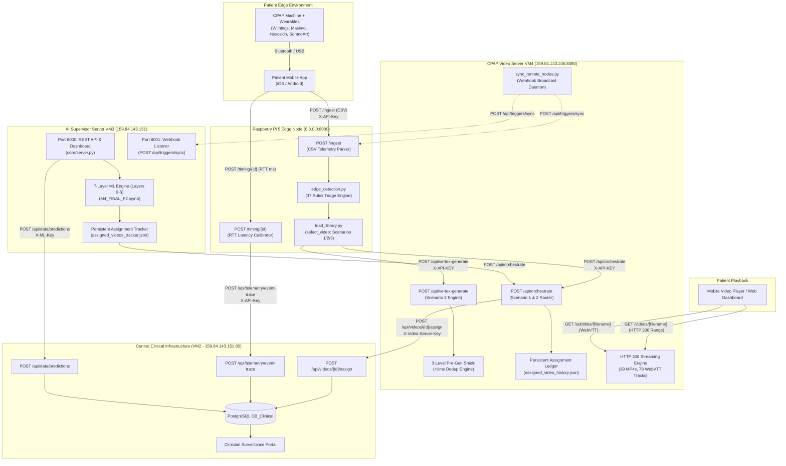
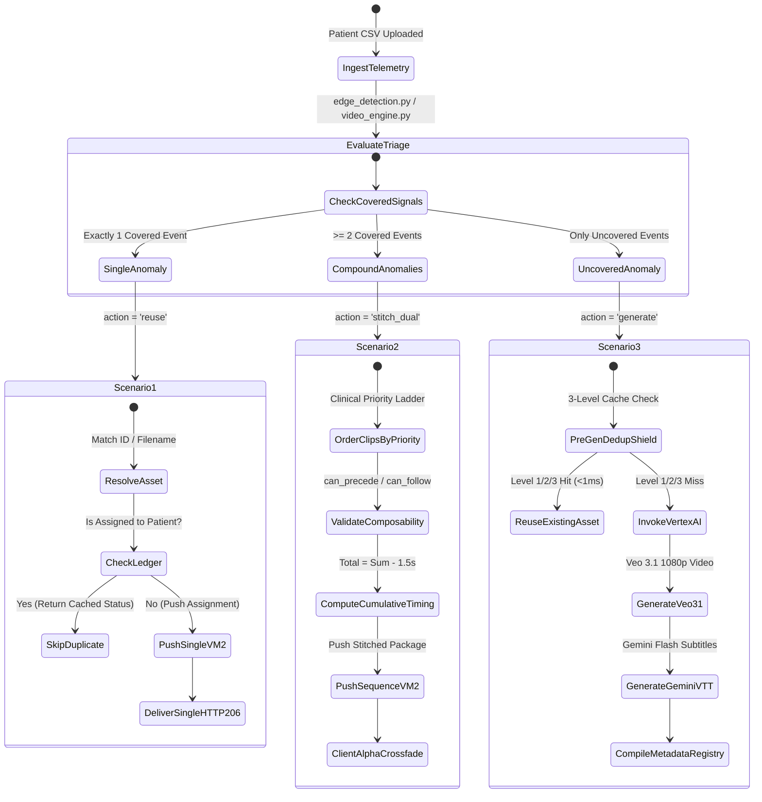

# SleepCare CPAP Ecosystem: System Architecture Specification

> DISP Laboratory (Université Lumière Lyon 2 / INSA Lyon) and Linde HomeCare France  
> Author: Pamit Duggal (Software and AI Engineering Intern)  
> Scope: System topology, latency accounting, and communication boundaries

---

## 1. Design principles

We organized SleepCare around four core engineering decisions:

1. **Separation of concerns**:
   - The Raspberry Pi edge node evaluates therapy problems close to the patient. It does not store videos or run database queries. It parses CSV telemetry in less than 6 ms and keeps raw data on the local network.
   - The Video Server on VM4 handles media delivery. It serves 39 video clips over HTTP 206 byte ranges, caches generative prompts, and calls Google Vertex AI when a custom clip is needed.
   - The AI Supervisor on VM3 processes population trends. It runs a 7-layer machine learning pipeline across longitudinal cohorts to calculate abandonment probabilities and intervention effectiveness.
   - The Central Clinical Backend on VM2 acts as the system of record. It stores patient histories in PostgreSQL and powers the clinician web portal.

2. **Client-side virtual stitching**:
   Rendering concatenated videos on the server with FFmpeg wastes CPU cycles and adds seconds of latency. Instead, when a patient has compound issues, the server returns an ordered list of clips (`clips: [first, second]`). The client player loads both and applies a 1.5-second opacity crossfade (`fade_1_5s`), making playback appear seamless without server re-encoding.

3. **Sub-second latency target**:
   From the moment a patient phone sends a nightly export to the moment the video player buffers the first frame, total execution takes between 350 and 550 ms in our benchmarks. This sits safely inside our 60-second clinical budget.

4. **Deduplication at every tier**:
   Patients get frustrated if an automated system shows them the same tutorial every morning. We maintain persistent assignment ledgers to avoid re-prescribing recently watched videos, and an in-memory hash shield prevents duplicate calls to Google Veo.

---

## 2. End-to-end topology



---

## 3. Telemetry latency pipeline

We track millisecond timestamps through each event transition:

```text
Timeline (ms):
 0ms      35-55ms    120-180ms    185ms       190ms       195ms       202ms       205ms
  t0 -------> t1 ---------> t2 -----> t3 -------> t4 -------> t5 -------> t6 -------> t7
Sensor     Edge Pi     ML Risk     Clinical     Dispatched   Video VM   Backend     Media
Reading    Ingest      Inference   Decision     to VM4       Ingress    Pushed      Stream TTFB
```

### Breakdown of timestamp phases

| Phase | Description | SLA Target | Typical Measured Value | Handling Node |
| :---: | :--- | :---: | :---: | :--- |
| **t0** | Sensor generation at patient CPAP or wearable | Baseline | 0 ms | Patient Hardware |
| **t1** | CSV ingest and parsing on Raspberry Pi (`POST /ingest`) | < 100 ms | 35 to 55 ms | Pi Edge (`app.py`) |
| **t2** | AI risk scoring on AI Server (VM3) | < 250 ms | 120 to 180 ms | AI Server (`core/pipeline.py`) |
| **t3** | Rule engine selects intervention | < 10 ms | 2 to 6 ms | Pi / AI Decision Engine |
| **t4** | Network transit from Edge / AI to Video Server | Network RTT | 3 to 8 ms | Network |
| **t5** | Inbound request arrives at Video VM (`/api/orchestrate`) | Ingress | Ingress | Video VM4 |
| **t6** | Clip resolved, ledger updated, assignment pushed to VM2 | < 15 ms | 3.6 to 8.2 ms | Video VM4 -> Central VM2 |
| **t7** | First video byte delivered to client (TTFB) | < 5 ms | 2.1 to 2.8 ms | HTTP 206 Streaming Engine |

Total turnaround time follows:
$$\text{Total Turnaround} = (t_{\text{received}} - t_{\text{sent}}) + \text{Pi Processing} + \text{VM Push Latency}$$

In our tests, full turnaround ranged between 350 and 550 ms against our 60-second budget limit.

---

## 4. The three intervention scenarios



### Scenario 1: Pre-recorded single clip
Used when the patient experiences one isolated issue, such as a moderate mask leak (24 to 30 L/min) or a dry mouth complaint. The Video VM checks that the file exists, attaches URLs for English and French subtitles, verifies that the patient has not already seen this clip recently, and alerts the clinical backend.

### Scenario 2: Virtual stitched sequence
Used when multiple issues appear simultaneously, for instance a severe leak combined with low usage hours. The engine picks the two most urgent events, orders them by clinical severity (`critical` > `high` > `medium` > `low`), and checks composability rules in `metadata/video_XX.json` to make sure the transition makes sense. The total duration subtracts the overlap:
$$\text{Duration}_{\text{total}} = \sum_{i=1}^n \text{Duration}_i - (n - 1) \times 1.5\text{s}$$

The client player preloads Clip 2 in the background and fades into it 1.5 seconds before Clip 1 finishes.

### Scenario 3: Generative video with Google Veo 3.1
Used when wearable signals show unusual patterns not covered by the 37 standard videos, such as irregular overnight heart rate changes coinciding with low oxygen saturation. The system checks the prompt against its deduplication shield. If the prompt was rendered previously, it serves the cached MP4. If new, it calls Google Vertex AI, prompts Gemini 1.5 Flash to generate bilingual subtitles, and writes a new metadata profile into the catalog.

---

## 5. Network links and ports

| Communication Link | Source Node | Destination Node | Port | Payload Format | Authentication |
| :--- | :--- | :--- | :--- | :--- | :--- |
| Phone to Pi Ingest | Patient Phone | Pi Edge Node | HTTP 8000 | Multipart form-data (CSV) | `X-API-Key: <API_KEY>` |
| Phone to Pi Timing | Patient Phone | Pi Edge Node | HTTP 8000 | JSON (`{"rtt_ms": float}`) | `X-API-Key: <API_KEY>` |
| Pi to Video VM | Pi Edge Node | Video VM4 | HTTP 8080 | JSON (`/api/orchestrate`) | `X-API-KEY: <SERVER_API_KEY>` |
| AI Server to Video VM | AI Server VM3 | Video VM4 | HTTP 8080 | JSON (`/api/orchestrate`) | `X-API-KEY: <SERVER_API_KEY>` |
| Video VM to Backend | Video VM4 | Central VM2 | HTTP 80 | JSON (`/api/videos/{id}/assign`) | `X-Video-Server-Key: <KEY>` |
| Video VM to Telemetry | Video VM4 | Central VM2 | HTTP 80 | JSON (`/api/telemetry/event-trace`) | `X-API-Key: <BACKEND_API_KEY>` |
| Pi to Telemetry | Pi Edge Node | Central VM2 | HTTP 80 | JSON (`/api/telemetry/event-trace`) | `X-API-Key: <BACKEND_API_KEY>` |
| AI Server to Backend | AI Server VM3 | Central VM2 | HTTP 80 | JSON (`/api/data/predictions`) | `X-ML-Key: <BACKEND_API_KEY>` |
| Video VM to AI Sync | Video VM4 | AI Server VM3 | HTTP 8001 | JSON (`/api/triggers/sync`) | `X-API-KEY` & `X-ML-Key` |
| Video VM to Pi Sync | Video VM4 | Pi Edge Node | HTTP 8000 | JSON (`/api/triggers/sync`) | Internal |
| Client to Video Stream | Mobile / Web App | Video VM4 | HTTP 8080 | HTTP 206 Partial Content | Public Read |
| Client to Subtitles | Mobile / Web App | Video VM4 | HTTP 8080 | HTTP 200 WebVTT | Zero-Cache |

---

## 6. Catalog synchronization across nodes

When new coaching videos are added on VM4, the updated trigger definitions must reach the AI Server and the Pi. We support two synchronization paths:

```text
                       +-----------------------------------------+
                       |         CPAP Video Server (VM4)         |
                       |          (Catalog Authority)            |
                       +--------------------+--------------------+
                                            |
               +----------------------------+----------------------------+
               | Broadcast event (sync_remote_nodes.py)                  |
               |                                                         |
               v (Push Webhook)                                          v (Push Webhook)
 +---------------------------+                             +---------------------------+
 │ AI Supervisor Server VM3  │                             │   Raspberry Pi Edge Node  │
 │ Port 8001 listener        │                             │   Port 8000 listener      │
 │ POST /api/triggers/sync   │                             │   POST /api/triggers/sync │
 +-------------+-------------+                             +-------------+-------------+
               |                                                         |
               | (Fallback: Polling)                                     | (Fallback: Polling)
               +-----------------------> GET :8080/api/triggers/catalog -+
```

1. **Scheduled polling**: Nodes hit `GET http://159.84.143.246:8080/api/triggers/catalog` on startup and during hourly maintenance checks.
2. **Push webhooks**: When someone runs `update_master_metadata.py` on VM4, `sync_remote_nodes.py` fires background HTTP POST requests to port 8001 on the AI server and port 8000 on the Pi, with short timeouts so a down node never stalls the caller.

---

## 7. Reliability mechanisms

- **Background telemetry dispatch**: Telemetry writes to VM2 run in background tasks. Even if the central backend is slow or temporarily unreachable, the phone app gets its response immediately.
- **Atomic ledger updates**: File writes to `assigned_video_history.json` and `assigned_videos_tracker.json` write to a `.tmp` file before an atomic rename. This prevents corrupted JSON if the process is killed mid-write.
- **Safe fallback on VM outage**: If the Video VM goes down, the edge node logs a warning and informs the mobile app cleanly rather than raising an unhandled 500 error.
- **Localhost lock on management dashboards**: Admin control endpoints reject requests originating outside localhost to prevent unauthorized config edits over public network interfaces.

Continue to [COMPONENTS.md](COMPONENTS.md) for internal module descriptions.
